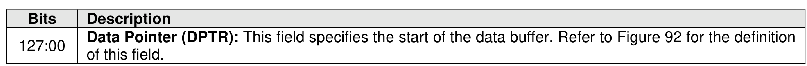
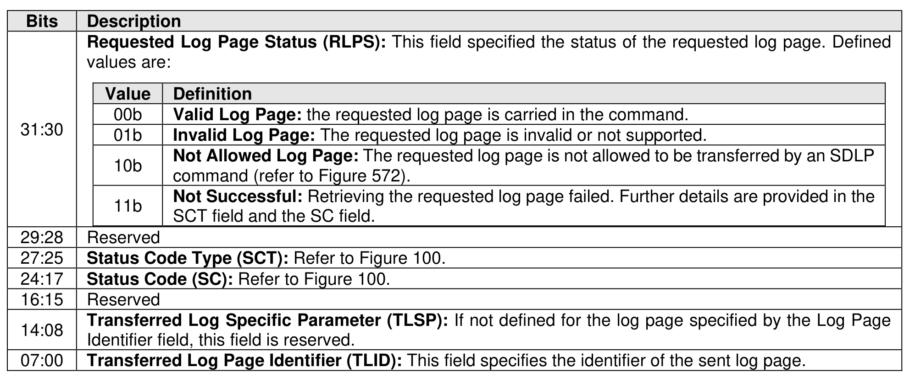
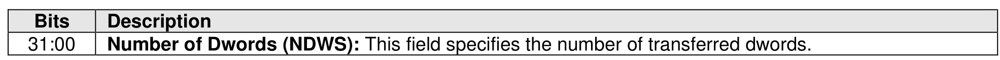
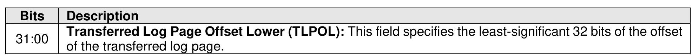
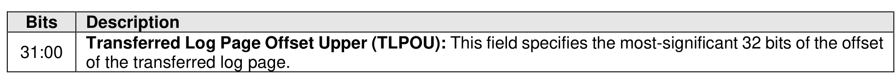
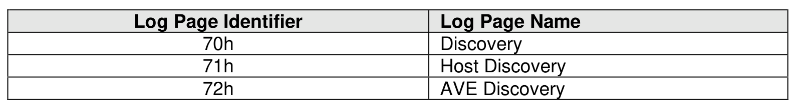
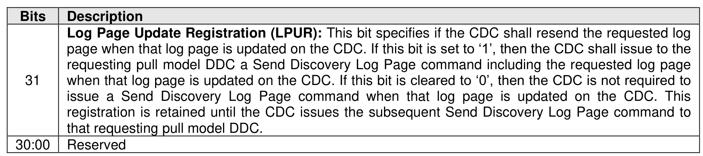

#### 5.4.11 Send Discovery Log Page command

> **Section ID**: 5.4.11 | **Page**: 511-512

The Send Discovery Log Page (SDLP) command is used by a CDC to send a discovery log page to a pull
model DDC. This command uses the Data Pointer, Command Dword 10, Command Dword 11, Command
Dword 12, and Command Dword 13, as shown in Figure 567, Figure 568, Figure 569, Figure 570, and
Figure 571 respectively.
The transferred log page has the same format of the correspondent discovery log page retrieved by a Get
Log Page command (refer to section 5.2.12). The discovery log pages allowed to be transferred by a SDLP
command are shown in Figure 572.
If a not allowed log page is requested, the CDC shall set the RLPS field (refer to Figure 568) to 02h (i.e.,
Not Allowed Log Page) and transfer no log page.
The pull model DDC receiving a SDLP command may request the CDC to resend the requested log page
when that log page is updated on the CDC. This is done through the LPUR bit in Dword 0 of the completion
queue entry for the SDLP command, as shown in Figure 573.

---
### 📊 Tables (7)

#### Table 1: Untitled Table

| Description |  |
| :--- | :--- |
| **Requested Log Page Status (RLPS):** This field specified the status of the requested log page. Defined values are: |  |
| **Value** | **Definition** |
| 10b | **Not Allowed Log Page:** The requested log page is not allowed to be transferred by an SDLP command (refer to Figure 572). |
| 11b | **Not Successful:** Retrieving the requested log page failed. Further details are provided in the SCT field and the SC field. |
| Reserved |  |
| Status Code Type (SCT): Refer to Figure 100. |  |
| Status Code (SC): Refer to Figure 100. |  |
| Reserved |  |
| Transferred Log Specific Parameter (TLSP): If not defined for the log page specified by the Log Page Identifier field, this field is reserved. |  |
| Transferred Log Page Identifier (TLID): This field specifies the identifier of the sent log page. |  |
| Figure 569: Send Discovery Log Page (SDLP) – Command Dword 11 |  |
| Description |  |
| Number of Dwords (NDWS): This field specifies the number of transferred dwords. |  |
| Figure 570: Send Discovery Log Page (SDLP) – Command Dword 12 |  |
| Description |  |
| Transferred Log Page Offset Lower (TLPOL): This field specifies the least-significant 32 bits of the offset of the transferred log page. |  |
| Figure 571: Send Discovery Log Page (SDLP) – Command Dword 13 |  |
| Transferred Log Page Offset Upper (TLPOU): This field specifies the most-significant 32 bits of the offset of the transferred log page. |  |
| 72h | AVE Discovery |
| If no log page is requested, the CDC shall set the RLPS field (refer to Figure 568) to 02h (i.e.,  and transfer no log page. |  |
| Sending a SDLP command may request the CDC to resend the requested log page  registration is retained until the CDC issues the subsequent Send Discovery Log Page command to  that requesting pull model DDC. |  |
| Reserved |  |

#### Table 2: Untitled Table

(Continuation of Untitled Table - see first part)

#### Table 3: Untitled Table

(Continuation of Untitled Table - see first part)

#### Table 4: Untitled Table

(Continuation of Untitled Table - see first part)

#### Table 5: Untitled Table

(Continuation of Untitled Table - see first part)

#### Table 6: Untitled Table

(Continuation of Untitled Table - see first part)

#### Table 7: Untitled Table

(Continuation of Untitled Table - see first part)

