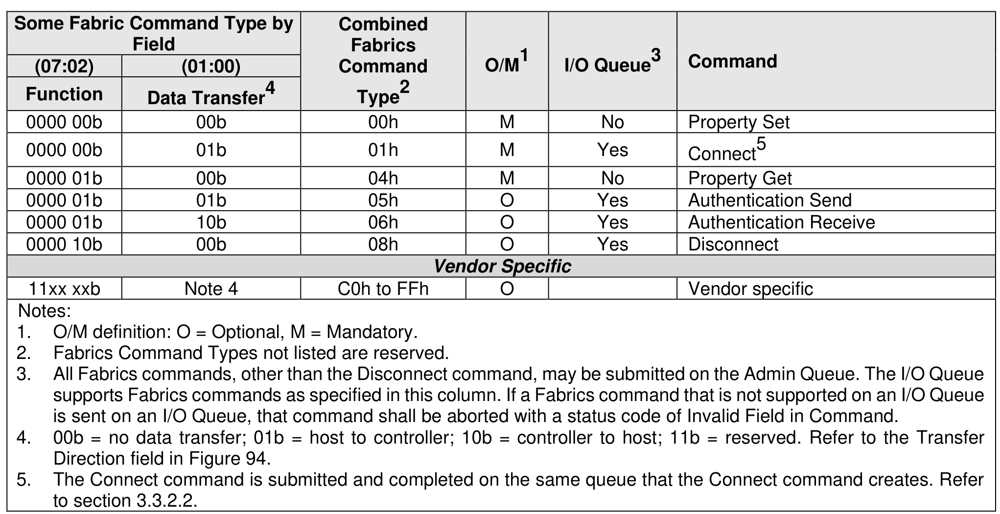

## 6 Fabrics Command Set

> **Section ID**: 6 | **Page**: 513-513

Fabrics commands are used to create queues and initialize a controller. Fabrics commands have an
Opcode field of 7Fh and are distinguished by the Fabrics Command Type as shown in Figure 574. Fabrics
commands are processed regardless of the state of controller enable (CC.EN). The Fabrics command
capsule is defined in section 3.3.2.1.1 and the Fabrics response capsule and status is defined in section
3.3.2.1.2. The common Fabrics Submission Queue entry is shown in Figure 94 and the common Fabrics
Completion Queue entry is shown in Figure 99.
Restrictions on processing commands listed in Figure 574 are defined in the Admin Command Set in
section 5 (e.g., while the NVM subsystem is performing a sanitize operation or processing of a Format NVM
command).

---
### 📊 Tables (1)

#### Table 1: Untitled Table

| 00b | 00b | 00h | M | No | Property Set |
|---|---|---|---|---|---|
| 00b | 01b | 01h | M | Yes | Connect5 |
| 01b | 00b | 04h | M | No | Property Get |
| 01b | 01b | 05h | O | Yes | Authentication Send |
| 01b | 10b | 06h | O | Yes | Authentication Receive |
| 10b | 00b | 08h | O | Yes | Disconnect |
| | | | | | |
| | | | | | |
| | | | | | |
| | | | | | |
| |

