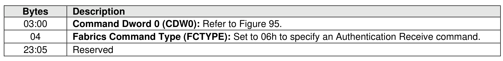
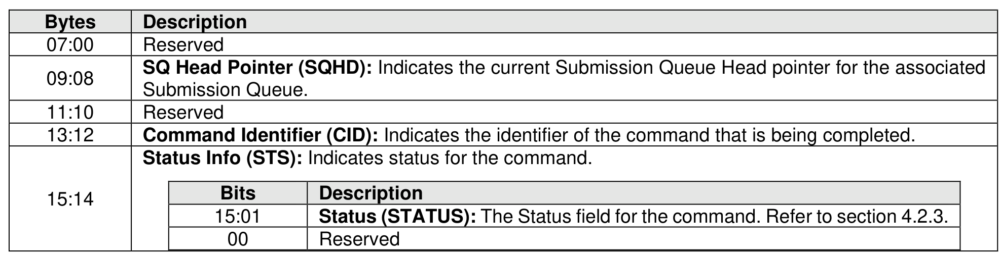

### 6.1 Authentication Receive Command and Response

> **Section ID**: 6.1 | **Page**: 513-514

The Authentication Receive command transfers the status and data result of one or more Authentication
Send commands that were previously submitted to the controller.
The association between an Authentication Receive command and previous Authentication Send
commands is dependent on the Security Protocol. The format of the data to be transferred is dependent on
the Security Protocol. Refer to SPC-5 for Security Protocol details.
Authentication Receive commands return the appropriate data corresponding to an Authentication Send
command as defined by the rules of the Security Protocol. The Authentication Receive command data shall
not be retained if there is a loss of communication between the controller and host, or if a Controller Level
Reset occurs.

---
### 📊 Tables (3)

#### Table 1: Untitled Table

| | Description |
|---|---|
| | Reserved |
| | **SP Specific 0 (SPSP0):** The value of this field contains bits 07:00 of the Security Protocol Specific field as defined in SPC-5. |
| | **SP Specific 1 (SPSP1):** The value of this field contains bits 15:08 of the Security Protocol Specific field as defined in SPC-5. |
| | **Security Protocol (SECP):** This field specifies the security protocol as defined in SPC-5. The controller shall abort the command with Invalid Parameter indicated if a reserved value of the Security Protocol is specified. |
| | **Allocation Length (AL):** The value of this field is specific to the Security Protocol as defined in SPC-5 where INC_512 is cleared to '0'. |
| | Reserved |
| | |
| | |
| | |
| | |
| | |
| | |
| | |
| | |
| | |
| | |

#### Table 2: Untitled Table

(Continuation of Untitled Table - see first part)

#### Table 3: Untitled Table

(Continuation of Untitled Table - see first part)

