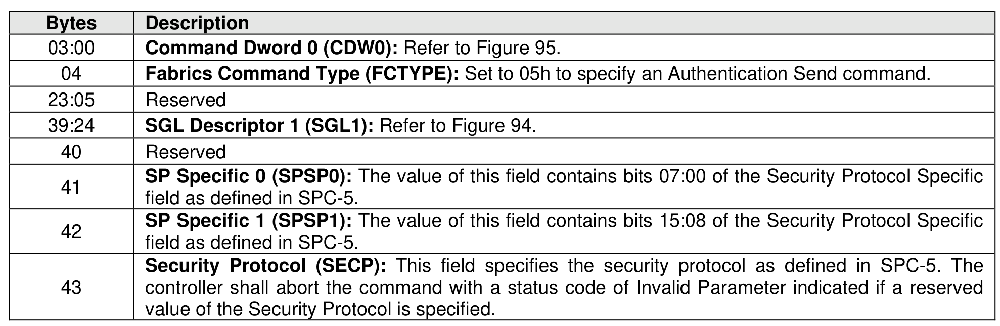
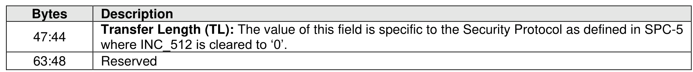

### 6.2 Authentication Send Command and Response

> **Section ID**: 6.2 | **Page**: 514-515

The Authentication Send command is used to transfer security protocol data to the controller. The data
structure transferred as part of this command contains security protocol specific commands to be performed
by the controller. The data structure may contain data or parameters associated with the security protocol
specific commands. Status and data that is to be returned to the host for the security protocol specific
commands submitted by an Authentication Send command are retrieved with the Authentication Receive
command defined in section 6.1.
The association between an Authentication Send command and subsequent Authentication Receive
commands is Security Protocol field dependent as defined in SPC-5.

---
### 📊 Tables (3)

#### Table 1: Untitled Table

| | Description |
|---|---|
| 0 | Reserved |
| 2 | **Command Identifier (CID):** Indicates the identifier of the command that is being completed. |
| | **Status Info (STS):** Indicates status for the command. |
| | | | | |
| | | | **Bits** | **Description** |
| | | | 15:01 | **Status (STATUS):** The Status field for the command. Refer to section 4.2.3. |
| | | | 00 | Reserved |

#### Table 2: Untitled Table

(Continuation of Untitled Table - see first part)

#### Table 3: Untitled Table

(Continuation of Untitled Table - see first part)

