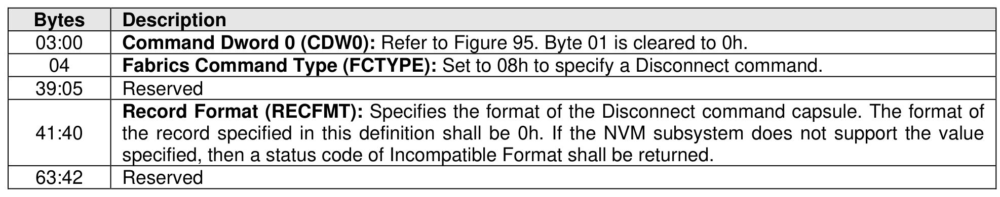
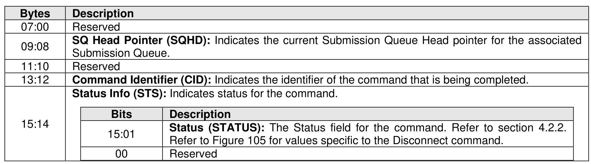

### 6.4 Disconnect Command and Response

> **Section ID**: 6.4 | **Page**: 520-521

The Disconnect command is used to delete the I/O Queue on which the command is submitted. If a
Disconnect command is submitted on an Admin Queue, then the controller shall abort the command with a
status code of Invalid Queue Type. If the controller is not able to delete the I/O Queue, then the controller
shall abort the command with a status code of Controller Busy. The fields for the submission queue entry
are defined in Figure 583.
The NVMe Transport connection is not deleted upon issuance of a Disconnect command; the host and
controller may delete the NVMe Transport connection and associated resources after all NVMe Queues
(I/O Queues and/or Admin Queue) associated with that NVMe Transport connection have been deleted
(refer to section 3.3.2.4).
The completion queue entry for the Disconnect command shall be the last entry submitted to the I/O Queue
Completion queue by the controller (i.e., no completion queue entries shall be submitted to the I/O Queue
Completion Queue after the completion queue entry for the Disconnect command). The controller shall
ensure that no further command processing is performed for any command on an I/O queue after sending
the completion queue entry for the Disconnect command.
The host should not submit commands to an I/O Submission Queue after the submission of a Disconnect
command to that I/O Submission Queue; submitting commands to an I/O Queue after a Disconnect
command is submitted to that I/O Queue results in undefined behavior.
The Disconnect response provides status for the Disconnect command. The Disconnect response is
defined in Figure 584.

---
### 📊 Tables (2)

#### Table 1: Untitled Table

| Bits | Description |
|---|---|
| 15:01 | **Status (STATUS)**: The Status field for the command. Refer to section 4.2.2. Refer to Figure 105 for values specific to the Disconnect command. |
| 00 | Reserved |

#### Table 2: Untitled Table

(Continuation of Untitled Table - see first part)

