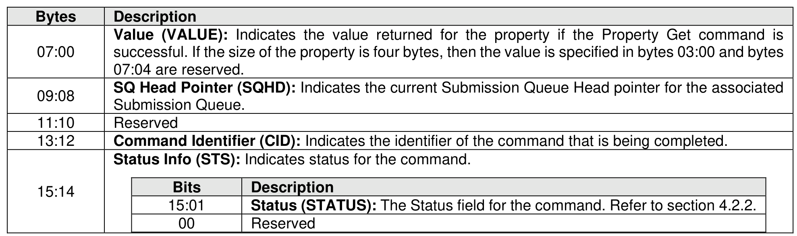

### 6.5 Property Get Command and Response

> **Section ID**: 6.5 | **Page**: 521-522

The Property Get command is used to specify the property value to return to the host (refer to section 3.1.4).
The fields for the Property Get command are defined in Figure 585. If an invalid property or invalid offset is
specified, then a status code of Invalid Field in Command shall be returned.
The Property Get response is used to return the value of the property requested to the host. The Property
Get response is defined in Figure 586.

---
### 📊 Tables (2)

#### Table 1: Untitled Table

| | | |
| :--- | :--- | :--- |
| | 000b | 4 bytes |
| | 001b | 8 bytes |
| | 010b to 111b | Reserved |
| | Reserved | |
| | **Offset (OFST):** Specifies the offset to the property to get. Refer to section 3.1.4. | |
| | Reserved | |
| | | |
| | | |
| | | |
| | | |
| | | |
| | | |
| | | |
|

#### Table 2: Untitled Table

(Continuation of Untitled Table - see first part)

