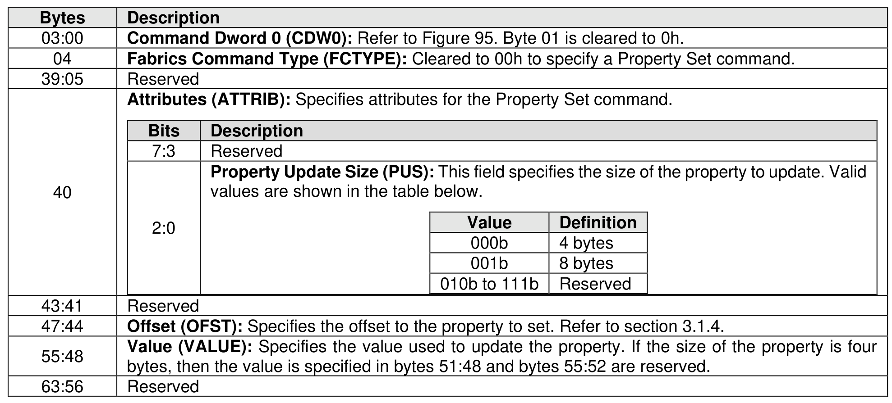
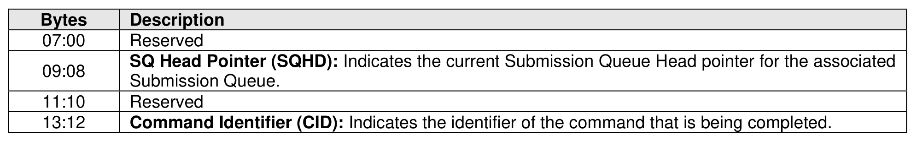
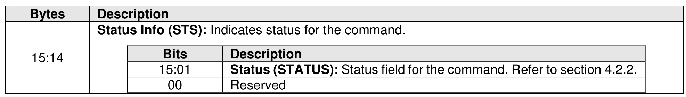

### 6.6 Property Set Command and Response

> **Section ID**: 6.6 | **Page**: 522-523

The Property Set command is used to set the value of a property (refer to section 3.1.4). The fields for the
Property Set command are defined in Figure 587. If an invalid property or invalid offset is specified, then a
status code of Invalid Field in Command shall be returned.
The Property Set response provides status for the Property Set command. The Property Set response is
defined in Figure 588.

---
### 📊 Tables (3)

#### Table 1: Untitled Table

| | | | |
|---|---|---|---|
| | | **Value** | **Definition** |
| | | 000b | 4 bytes |
| | | 001b | 8 bytes |
| | | 010b to 111b | Reserved |
| | | | |
| | 1 | Reserved | |
| | 4 | **Offset (OFST)**: Specifies the offset to the property to set. Refer to section 3.1.4. | |
| | 3 | **Value (VALUE)**: Specifies the value used to update the property. If the size of the property is four bytes, then the value is specified in bytes 51:48 and bytes 55:52 are reserved. | |
| | 6 | Reserved | |
| | | | |
| | | | |
| | | | |
| | | | |
| | | | |
| | | |

#### Table 2: Untitled Table

(Continuation of Untitled Table - see first part)

#### Table 3: Untitled Table

(Continuation of Untitled Table - see first part)

