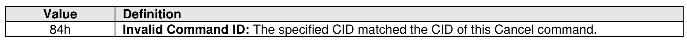
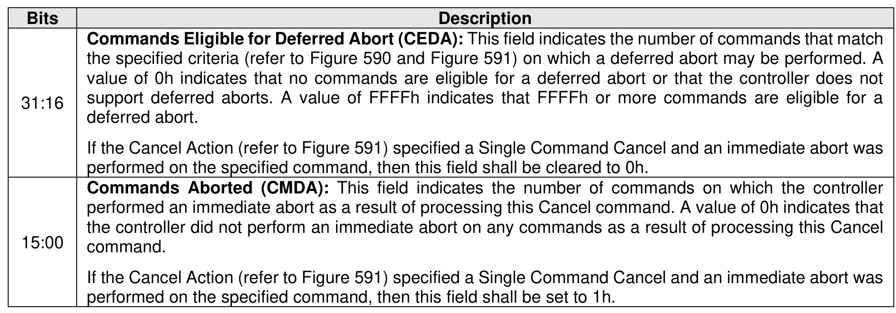

#### 7.1.1 Command Completion

> **Section ID**: 7.1.1 | **Page**: 526-527

Upon completion of the Cancel command, the controller posts a completion queue entry to the I/O
Completion Queue indicating the status for the Cancel command.
If the Cancel Action (refer to Figure 591) specified a Single Command Cancel Action and the Commands
Aborted field is cleared to 0h, then the host should examine the status in the completion queue entry of the
command to abort to determine whether the command was aborted or not (i.e., whether a deferred abort
was performed or not).
If the Cancel Action specified a Multiple Command Cancel Action, then the host should examine the status
in the completion queue entry of each command to abort to determine whether the command was aborted
or not.
Cancel command specific status code values are defined in Figure 592.
Dword 0 of the completion queue entry contains information about the number of commands that were
aborted by this command. Dword 0 of the completion queue entry is defined in Figure 593.

---
### 📊 Tables (2)

#### Table 1: Untitled Table

| | |
| :--- | :--- |
| the specified criteria (refer to Figure 590 and Figure 591) on which a deferred abort may be performed. A value of 0h indicates that no commands are eligible for a deferred abort or that the controller does not support deferred aborts. A value of FFFFh indicates that FFFFh or more commands are eligible for a deferred abort. | |
| If the Cancel Action (refer to Figure 591) specified a Single Command Cancel and an immediate abort was performed on the specified command, then this field shall be cleared to 0h. | |
| **Commands Aborted (CMDA)**: This field indicates the number of commands on which the controller performed an immediate abort as a result of processing this Cancel command. A value of 0h indicates that the controller did not perform an immediate abort on any commands as a result of processing this Cancel command. | |
| If the Cancel Action (refer to Figure 591) specified a Single Command Cancel and an immediate abort was performed on the specified command, then this field shall be set to 1h. | |
| **Flush command** | |
| h command is used to request that the contents of volatile write cache be made non-volatile. | |
| tile write cache is enabled (refer to section 5.2.26.1.4), then the Flush command shall commit data | |
| adata associated with the specified namespace(s) to non-volatile storage media. The flush applies | |
| commands for the specified namespace(s) completed by the controller prior to the submission of the | |

#### Table 2: Untitled Table

(Continuation of Untitled Table - see first part)

