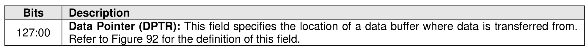
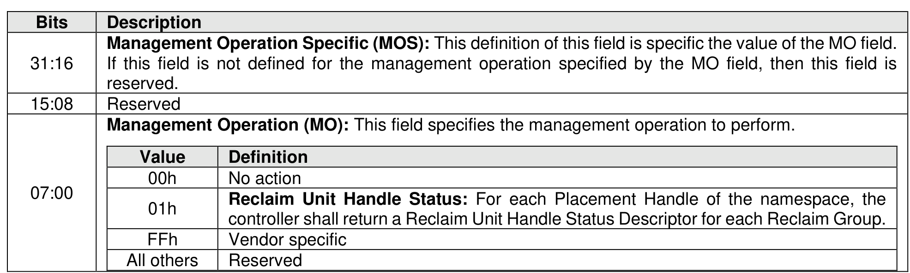
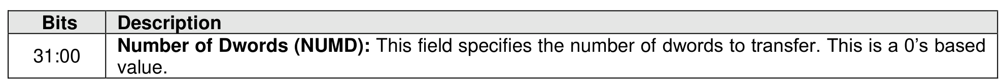

### 7.3 I/O Management Receive command

> **Section ID**: 7.3 | **Page**: 528-528

The I/O Management Receive command is used to receive information from the controller used by the host
to manage I/O. The behavior of the command is dependent on the specified operation as defined in the
Management Operation field in Figure 595.
The command uses the Data Pointer, Command Dword 10, and Command Dword 11 fields. All other
command specific fields are reserved. If the command uses PRPs for the data transfer, then the PRP Entry
1 and PRP Entry 2 fields are used. If the command uses SGLs for the data transfer, then the SGL Entry 1
field is used. All other command specific fields are reserved.
If the Number of Dwords (NUMD) field corresponds to a length that is less than the size of the data structure
to be returned, then only that specified portion of the data structure is transferred. If the NUMD field
corresponds to a length that is greater than the size of the associated data structure, then the entire contents
of the data structure are transferred and no additional data is transferred, unless otherwise specified.

---
### 📊 Tables (3)

#### Table 1: Untitled Table

| Description | |
| :--- | :--- |
| Management Operation Specific (MOS): This definition of this field is specific the value of the MO field. If this field is not defined for the management operation specified by the MO field, then this field is reserved. | |
| | |
| Value | Command |
| 00h | No action |
| 01h | **Reclaim Unit Handle Status**: For each Placement Handle of the namespace, the controller shall return a Reclaim Unit Handle Status Descriptor for each Reclaim Group. |
| FFh | Vendor specific |
| All others | Reserved |
| | |
| Figure 596: I/O Management Receive – Command Dword 11 | |
| Description | |
| Number of Dwords (NUMD): This field specifies the number of dwords to transfer. This is a 0's based value. | |
| | |
| I/O Management Receive Operations | |
| Reclaim Unit Handle Status (Management Operation 01h) | |
| | |
| Reclaim Unit Handle Status management operation is used to provide information about Reclaim Unit | |
| or: | |
| s the information at the time the controller processes that Reclaim Unit Handle Status Descriptor; | |
| and | |
| may or may not contain the information reflecting any outstanding command that affects the | |

#### Table 2: Untitled Table

(Continuation of Untitled Table - see first part)

#### Table 3: Untitled Table

(Continuation of Untitled Table - see first part)

