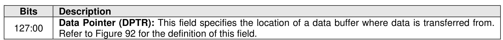
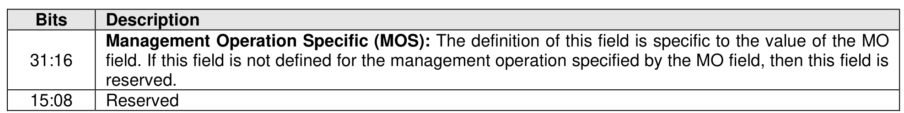
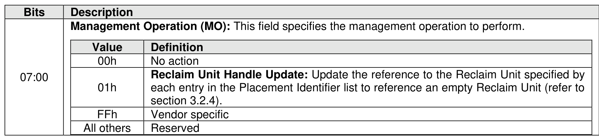

### 7.4 I/O Management Send command

> **Section ID**: 7.4 | **Page**: 529-530

The I/O Management Send command is used to manage I/O and the behavior of the command is dependent
on the specified operation as defined in the Management Operation field in Figure 599.
The command uses the Data Pointer and Command Dword 10 field. All other command specific fields are
reserved. If the command uses PRPs for the data transfer, then the PRP Entry 1 and PRP Entry 2 fields
are used. If the command uses SGLs for the data transfer, then the SGL Entry 1 field is used. All other
command specific fields are reserved.

---
### 📊 Tables (3)

#### Table 1: Untitled Table

| Value | Definition |
|---|---|
| 00h | No action |
| 01h | **Reclaim Unit Handle Update**: Update the reference to the Reclaim Unit specified by each entry in the Placement Identifier list to reference an empty Reclaim Unit (refer to section 3.2.4). |
| FFh | Vendor specific |
| All others | Reserved |

#### Table 2: Untitled Table

(Continuation of Untitled Table - see first part)

#### Table 3: Untitled Table

(Continuation of Untitled Table - see first part)

