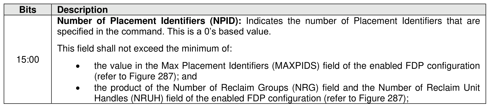
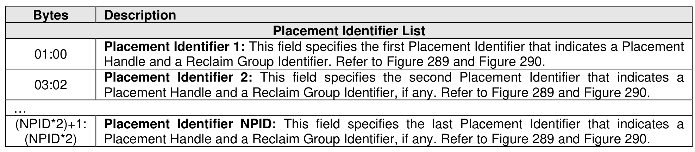

##### 7.4.1.1 Reclaim Unit Handle Update (Management Operation 01h)

> **Section ID**: 7.4.1.1 | **Page**: 530-531

The Reclaim Unit Handle Update management operation for the I/O Management Send command provides
a list of Placement Identifiers (refer to Figure 601). The number of Placement Identifiers is defined in the
Management Operation Specific field defined in Figure 600. For each Placement Identifier in the list:
•
If the currently referenced Reclaim Unit has been written with user data, then the Placement
Identifier shall be modified to reference a different Reclaim Unit that is empty (refer to section 3.2.4);
and
•
If the currently referenced Reclaim Unit has not been written with any user data (i.e., is already
empty), then the Placement Identifier may be modified to reference a different Reclaim Unit that is
empty.
If a specified Placement Identifier is invalid due to:
•
the value of the Reclaim Group Identifier field being greater than or equal to the Number of Reclaim
Groups field of the FDP Configuration Descriptor (refer to Figure 287) for the Endurance Group
associated with the specified namespace; or
•
the specified Placement Handle field being greater than or equal to the Number of Placement
Handles field specified when the namespace was created,
then the controller shall abort the command with a status code of Invalid Field in Command.
If the value represented by the Number of Placement Identifiers (NPID) field is greater than the Max
Placement Identifiers (MAXPIDS) field (refer to Figure 287) in the current FDP configuration, then the
controller shall abort the command with a status code of Invalid Field in Command.
If the command is aborted, then Placement Identifiers may or may not have been updated.
While processing an I/O Management Send command that specifies the Reclaim Unit Handle Update
operation, if the controller processes a write command that utilizes a Placement Identifier specified in the
Placement Identifier List of that I/O Management Send command, then the controller may write the user
data for that write command to the referenced Reclaim Unit:
•
prior to processing that I/O Management Send command; or
•
upon the completion of that I/O Management Send command.
If Flexible Data Placement is disabled in the Endurance Group containing the specified namespace, then
the controller shall abort the command with a status code of FDP Disabled.

---
### 📊 Tables (2)

#### Table 1: Untitled Table

| | | |
|---|---|---|
| 0 | | Placement Identifier 1: This field specifies the first Placement Identifier that indicates a Placement Handle and a Reclaim Group Identifier. Refer to Figure 289 and Figure 290. |
| 2 | | Placement Identifier 2: This field specifies the second Placement Identifier that indicates a Placement Handle and a Reclaim Group Identifier, if any. Refer to Figure 289 and Figure 290. |
| (2)+1: | | Placement Identifier NPID: This field specifies the last Placement Identifier that indicates a Placement Handle and a Reclaim Group Identifier, if any. Refer to Figure 289 and Figure 290. |
| *2) | | |

#### Table 2: Untitled Table

(Continuation of Untitled Table - see first part)

