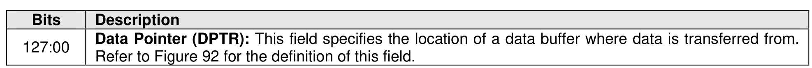
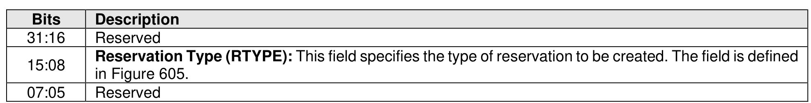
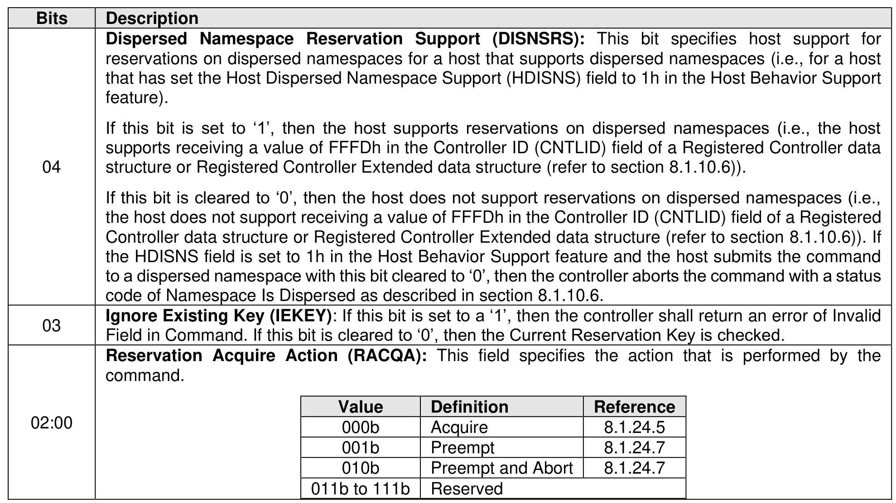
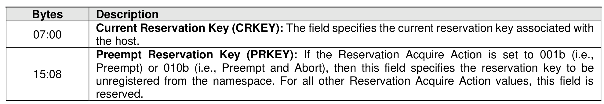
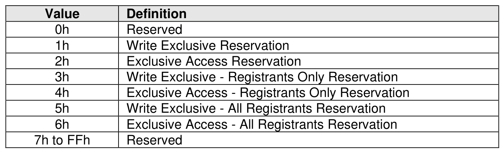

### 7.5 Reservation Acquire command

> **Section ID**: 7.5 | **Page**: 531-532

The Reservation Acquire command is used to:
•
acquire a reservation on a namespace;
•
preempt a reservation held on a namespace; or
•
preempt a reservation held on a namespace and abort outstanding commands for that namespace.
The command uses Command Dword 10 and a Reservation Acquire data structure in memory. If the
command uses PRPs for the data transfer, then PRP Entry 1 and PRP Entry 2 fields are used. If the
command uses SGLs for the data transfer, then the SGL Entry 1 field is used. All other command specific
fields are reserved.

---
### 📊 Tables (5)

#### Table 1: Untitled Table

| Value | Definition | Reference |
| :--- | :--- | :--- |
| 000b | Acquire | 8.1.24.5 |
| 001b | Preempt | 8.1.24.7 |
| 010b | Preempt and Abort | 8.1.24.7 |
| 011b to 111b | Reserved | |
| Value | Definition | |
| :--- | :--- | :--- |
| 0h | Reserved | |
| 1h | Write Exclusive Reservation | |
| 2h | Exclusive Access Reservation | |
| 3h | Write Exclusive - Registrants Only Reservation | |
| 4h | Exclusive Access - Registrants Only Reservation | |
| 5h | Write Exclusive - All Registrants Reservation | |
| 6h | Exclusive Access - All Registrants Reservation | |
| 7h to FFh | Reserved | |

#### Table 2: Untitled Table

(Continuation of Untitled Table - see first part)

#### Table 3: Untitled Table

(Continuation of Untitled Table - see first part)

#### Table 4: Untitled Table

(Continuation of Untitled Table - see first part)

#### Table 5: Untitled Table

(Continuation of Untitled Table - see first part)

