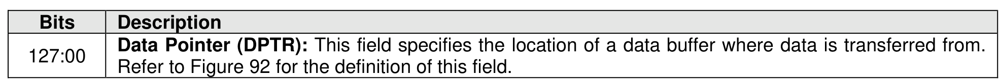
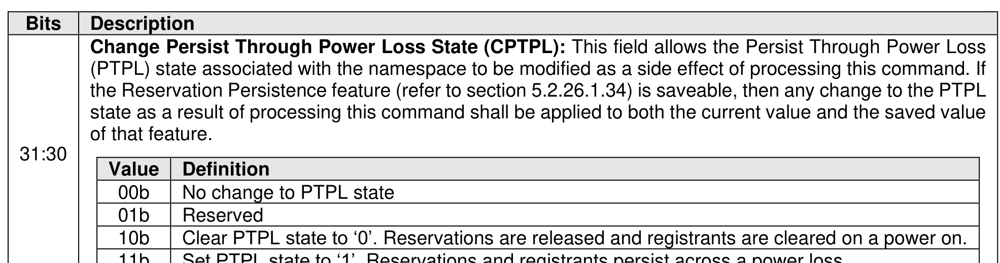
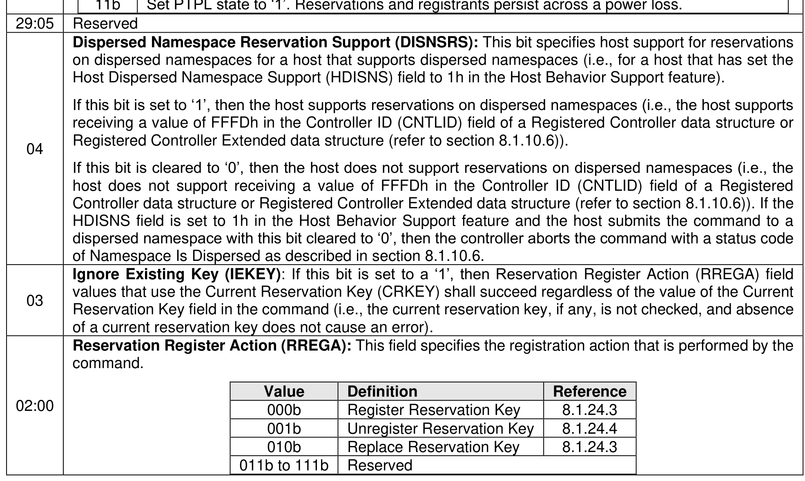
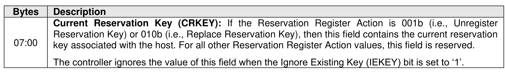
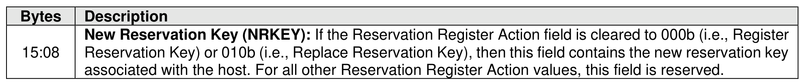

### 7.6 Reservation Register command

> **Section ID**: 7.6 | **Page**: 532-534

The Reservation Register command is used to register, unregister, or replace a reservation key.
The command uses Command Dword 10 and a Reservation Register data structure in memory (refer to
Figure 608). If the command uses PRPs for the data transfer, then PRP Entry 1 and PRP Entry 2 fields are
used. If the command uses SGLs for the data transfer, then the SGL Entry 1 field is used. All other command
specific fields are reserved.

---
### 📊 Tables (5)

#### Table 1: Untitled Table

| Value | Definition |
|:---|:---|
| 00b | No change to PTPL state |
| 01b | Reserved |
| 10b | Clear PTPL state to '0'. Reservations are released and registrants are cleared on a power on. |
| 11b | Set PTPL state to '1'. Reservations and registrants persist across a power loss. |

**Reserved**

**Dispersed Namespace Reservation Support (DISNSRS):** This bit specifies host support for reservations on dispersed namespaces for a host that supports dispersed namespaces (i.e., for a host that has set the Host Dispersed Namespace Support (HDISNS) field to 1h in the Host Behavior Support feature).

If this bit is set to '1', then the host supports reservations on dispersed namespaces (i.e., the host supports receiving a value of FFFDh in the Controller ID (CNTLID) field of a Registered Controller data structure or Registered Controller Extended data structure (refer to section 8.1.10.6)).

If this bit is cleared to '0', then the host does not support reservations on dispersed namespaces (i.e., the host does not support receiving a value of FFFDh in the Controller ID (CNTLID) field of a Registered Controller data structure or Registered Controller Extended data structure (refer to section 8.1.10.6)). If the HDISNS field is set to 1h in the Host Behavior Support feature and the host submits the command to a dispersed namespace with this bit cleared to '0', then the controller aborts the command with a status code of Namespace Is Dispersed as described in section 8.1.10.6.

**Ignore Existing Key (IEKEY):** If this bit is set to a '1', then Reservation Register Action (RREGA) field values that use the Current Reservation Key (CRKEY) shall succeed regardless of the value of the Current Reservation Key field in the command (i.e., the current reservation key, if any, is not checked, and absence of a current reservation key does not cause an error).

**Reservation Register Action (RREGA):** This field specifies the registration action that is performed by the command.

| Value | Definition | Reference |
|:---|:---|:---|
| 000b | Register Reservation Key | 8.1.24.3 |
| 001b | Unregister Reservation Key | 8.1.24.4 |
| 010b | Replace Reservation Key | 8.1.24.3 |
| 011b to 111b | Reserved | |

**Figure 608: Reservation Register Data Structure**

| Description |
|:---|
| **Current Reservation Key (CRKEY):** If the Reservation Register Action is 001b (i.e., Unregister Reservation Key) or 010b (i.e., Replace Reservation Key), then this field contains the new reservation key associated with the host. For all other Reservation Register Action values, this field is reserved. |
| The controller ignores the value of this field when the Ignore Existing Key (IEKEY) bit is set to '1'. |

#### Table 2: Untitled Table

(Continuation of Untitled Table - see first part)

#### Table 3: Untitled Table

(Continuation of Untitled Table - see first part)

#### Table 4: Untitled Table

(Continuation of Untitled Table - see first part)

#### Table 5: Untitled Table

(Continuation of Untitled Table - see first part)

