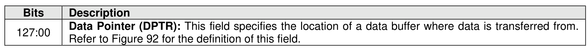
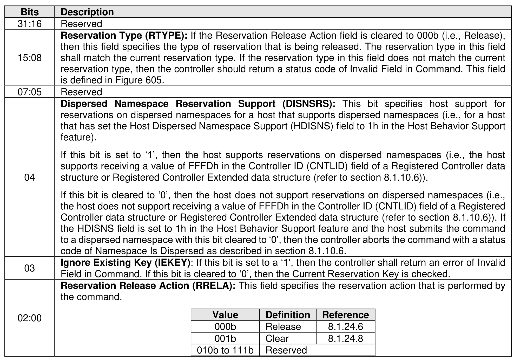
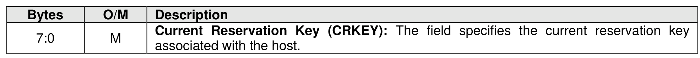

### 7.7 Reservation Release command

> **Section ID**: 7.7 | **Page**: 534-535

The Reservation Release command is used to release or clear a reservation held on a namespace.
The command uses Command Dword 10 and a Reservation Release data structure in memory. If the
command uses PRPs for the data transfer, then PRP Entry 1 and PRP Entry 2 fields are used. If the
command uses SGLs for the data transfer, then the SGL Entry 1 field is used. All other command specific
fields are reserved.

---
### 📊 Tables (3)

#### Table 1: Untitled Table

*(No markdown content)*

#### Table 2: Untitled Table

*(No markdown content)*

#### Table 3: Untitled Table

*(No markdown content)*

