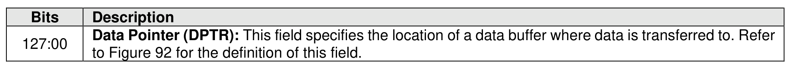
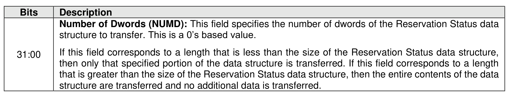
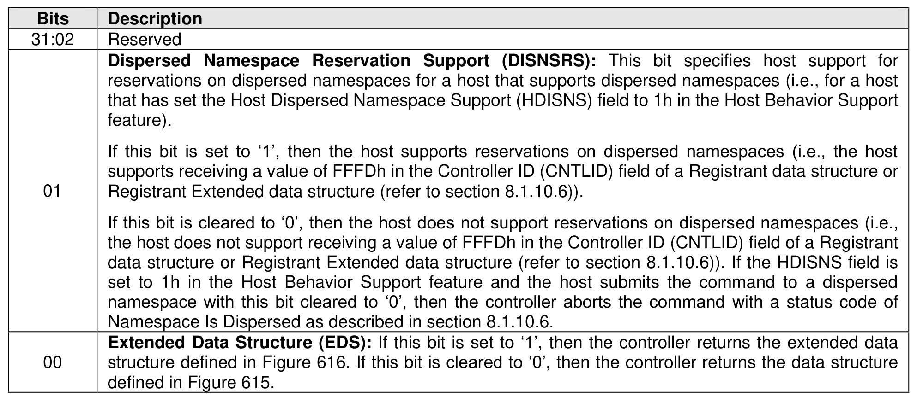
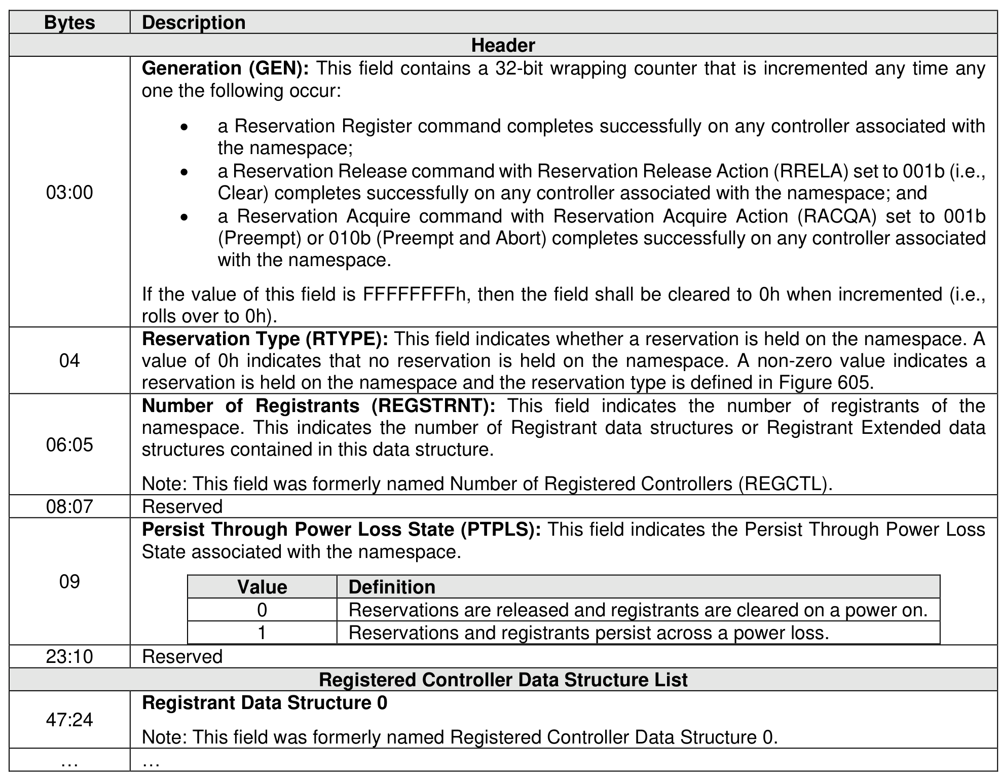
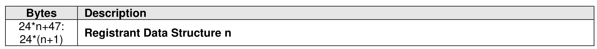
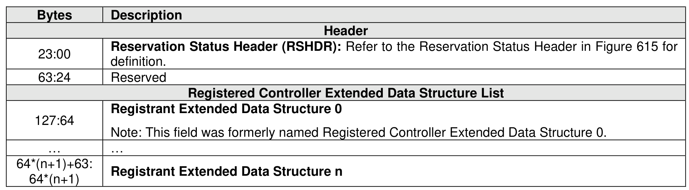
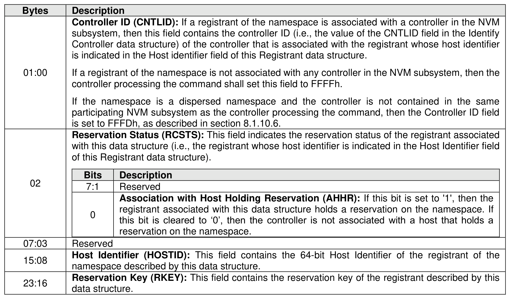
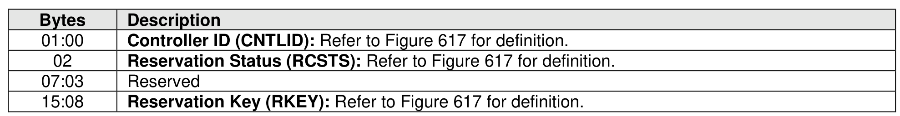
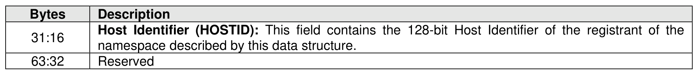

### 7.8 Reservation Report command

> **Section ID**: 7.8 | **Page**: 535-538

The Reservation Report command returns a Reservation Status data structure to memory that describes
the registration and reservation status of a namespace.
If the namespace is not a dispersed namespace, then the size of the Reservation Status data structure is
a function of the number of registrants of the namespace (i.e., there is a Registrant data structure and/or
Registrant Extended data structure for each such registrant). If the namespace is a dispersed namespace
that is able to be accessed by controllers in multiple participating NVM subsystems, then the size of the
Reservation Status data structure is a function of the number of registrants of the namespace in the NVM
subsystem containing the controller processing the command and the number of registrants of the
namespace in each separate participating NVM subsystem. The controller returns the data structure in
Figure 615 if the host has selected a 64-bit Host Identifier and the data structure in Figure 616 if the host
has selected a 128-bit Host Identifier (refer to section 5.2.26.1.32).
For controllers compliant with NVM Express Base Specification, Revision 2.0 and earlier, registrants of the
namespace that are not associated with any controller in the NVM subsystem may or may not be reported
by this command.
If a 64-bit Host Identifier has been specified and the Extended Data Structure bit is set to ‘1’ in Command
Dword 11, then the controller shall abort the command with the status code of Host Identifier Inconsistent
Format. If a 128-bit Host Identifier has been specified and the Extended Data Structure bit is cleared to ‘0’
in Command Dword 11, then the controller shall abort the command with the status code of Host Identifier
Inconsistent Format.
The command uses Command Dword 10 and Command Dword 11. If the command uses PRPs for the
data transfer, then PRP Entry 1 and PRP Entry 2 fields are used. If the command uses SGLs for the data
transfer, then the SGL Entry 1 field is used. All other command specific fields are reserved.

---
### 📊 Tables (9)

#### Table 1: Untitled Table

*(No markdown content)*

#### Table 2: Untitled Table

*(No markdown content)*

#### Table 3: Untitled Table

*(No markdown content)*

#### Table 4: Untitled Table

*(No markdown content)*

#### Table 5: Untitled Table

*(No markdown content)*

#### Table 6: Untitled Table

*(No markdown content)*

#### Table 7: Untitled Table

*(No markdown content)*

#### Table 8: Untitled Table

*(No markdown content)*

#### Table 9: Untitled Table

*(No markdown content)*

