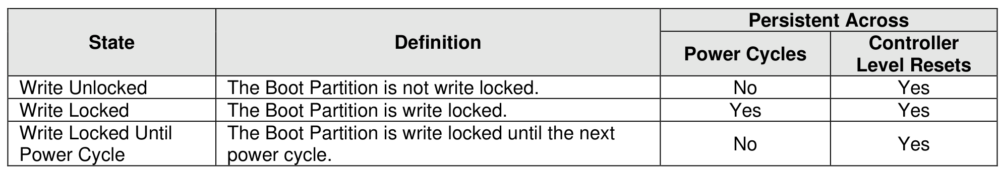

###### 8.1.3.3.1 Set Features Boot Partition Write Protection

> **Section ID**: 8.1.3.3.1 | **Page**: 550-551

Figure 624 shows an overview of the Boot Partition write protection states for each Boot Partition when only
Set Features Boot Partition Write Protection is supported.
If Set Features Boot Partition Write Protection is supported, then the default state for all Boot Partitions is
the Write Locked state. In this state, a host may read from a Boot Partition but is unable to modify that Boot
Partition. To enable modification of a Boot Partition, a host has to first transition the Boot Partition to the
Write Unlocked state by setting the appropriate Boot Partition Write Protection State to Write Unlocked
using the Boot Partition Write Protection Config feature via the Set Features command.
In the Write Unlocked state, a host may read from and modify a Boot Partition. Any Boot Partition in a Write
Unlocked state transitions to the Write Locked state when the controller undergoes a power cycle.
If Set Features Boot Partition Write Protection is supported, then both Boot Partitions support a Write
Locked Until Power Cycle state. In this state, the Boot Partition can be read from but is prohibited from
being modified. Additionally, once a Boot Partition enters the Write Locked Until Power Cycle state, the
Boot Partition remains in this state until the controller is power cycled.
The Write Locked Until Power Cycle state is prohibited in multi-domain NVM subsystems with Boot
Partitions shared across controllers (e.g., since clearing that state requires simultaneous power cycle of all
controllers that share the Boot Partitions). The result of a command that attempts to use that state in a
multi-domain NVM subsystem is specified in section 5.2.26.1.36.

---
### 📊 Tables (1)

#### Table 1: Untitled Table

| | | Power Cycles | Level Resets |
|---|---|---|---|
| Unlocked | The Boot Partition is not write locked. | No | Yes |
| Locked | The Boot Partition is write locked. | Yes | Yes |
| Locked Until Cycle | The Boot Partition is write locked until the next power cycle. | No | Yes |

