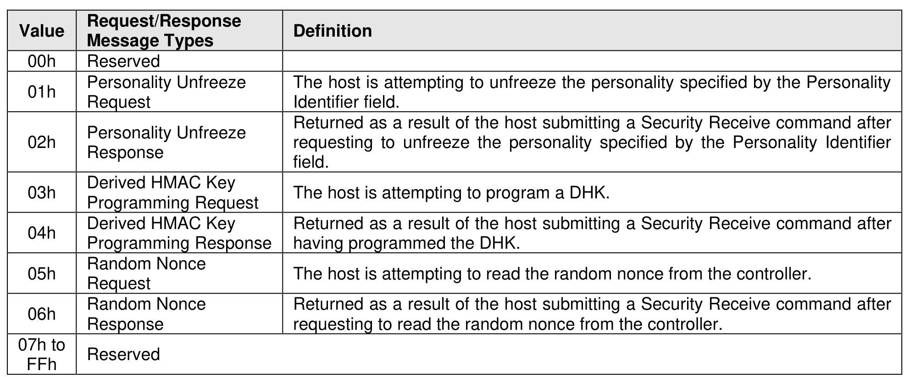

###### 8.1.6.1.1 Configurable Device Personality Authentication

> **Section ID**: 8.1.6.1.1 | **Page**: 561-561

Security Send and Security Receive commands specifying the NVMe Security Protocol and using CDP
Authentication (refer to section 5.2.24.3) are used to submit a CDP request to the controller and to retrieve
the result of that request.
If a Security Receive command is processed by the controller prior to the controller having successfully
completed a Security Send command for the corresponding Request Message Type since the last
Controller Level Reset on that controller, then the Security Receive command shall be aborted with a status
code of Command Sequence Error.
Only the result from the most recent successfully processed Security Send command is able to be retrieved.
The message types defined in Figure 629 are used to exchange CDP requests and responses between a
host and a controller. Request Message Types are sent from the host to the controller. Response Message
Types are sent to the host from the controller.
The result of the CDP request (refer to the Result Code field in Figure 631) indicates whether a host CDP
request to the controller was successful or not.

---
### 📊 Tables (1)

#### Table 1: Untitled Table

| Derived HMAC Key Programming Response | Returned as a result of the host submitting a Security Receive command after having programmed the DHK. |
|---|---|
| Random Nonce Request | The host is attempting to read the random nonce from the controller. |
| Random Nonce Response | Returned as a result of the host submitting a Security Receive command after requesting to read the random nonce from the controller. |
| Reserved | |

