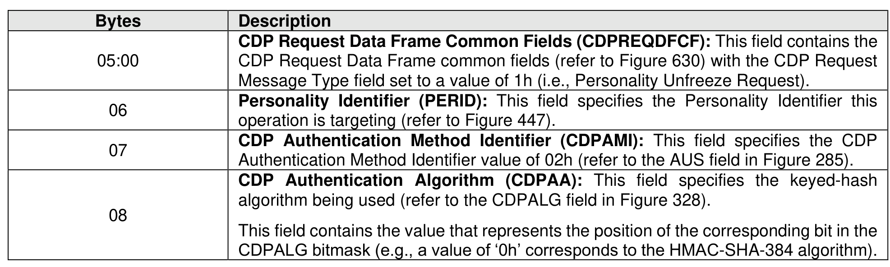
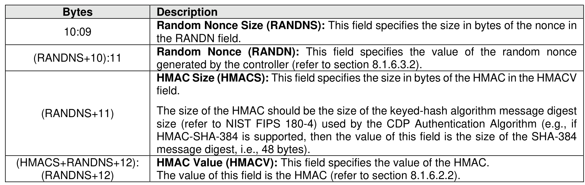

###### 8.1.6.2.1.1.1 CDP Programmable Key Authentication Unfreeze Request Data

> **Section ID**: 8.1.6.2.1.1.1 | **Page**: 564-565

Figure 632 specifies the Request Data for a Personality Unfreeze Request operation using Programmable
Key Authentication (refer to the AUS field in Figure 285).

---
### 📊 Tables (2)

#### Table 1: Untitled Table

| 10:09 | the RANDN field. |
| :--- | :--- |
| (RANDNS+10):11 | **Random Nonce (RANDN):** This field specifies the value of the random nonce generated by the controller (refer to section 8.1.6.3.2). |
| (RANDNS+11) | **HMAC Size (HMACS):** This field specifies the size in bytes of the HMAC in the HMACV field. The size of the HMAC should be the size of the keyed-hash algorithm message digest size (refer to NIST FIPS 180-4) used by the CDP Authentication Algorithm (e.g., if HMAC-SHA-384 is supported, then the value of this field is the size of the SHA-384 message digest, i.e., 48 bytes). |
| (RANDNS+RANDNS+12): (RANDNS+12) | **HMAC Value (HMACV):** This field specifies the value of the HMAC. The value of this field is the HMAC (refer to section 8.1.6.2.2). |

#### Table 2: Untitled Table

(Continuation of Untitled Table - see first part)

