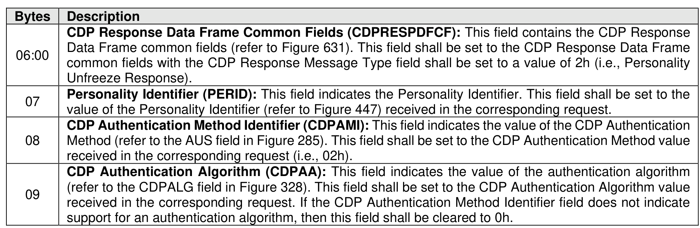

###### 8.1.6.2.1.1.2 CDP Programmable Key Authentication Unfreeze Response Data

> **Section ID**: 8.1.6.2.1.1.2 | **Page**: 565-565

Figure 633 specifies the Response Data for a Personality Unfreeze Request operation using Programmable
Key Authentication (refer to the AUS field in Figure 285).

---
### 📊 Tables (1)

#### Table 1: Untitled Table

| Bytes | Description |
|---|---|
| | CDP Request Data Frame Common Fields (CDPREQDFCF): This field contains the CDP Request Data Frame common fields (refer to Figure 630). This field shall be set to the CDP Request Data Frame common fields received in the corresponding request. |
| | CDP Authentication Method Identifier (CDPAMI): This field indicates the value of the CDP Authentication Method (refer to the AUS field in Figure 285). This field shall be set to the CDP Authentication Method value received in the corresponding request (i.e., 02h). |
| | CDP Authentication Algorithm (CDPAA): This field indicates the value of the authentication algorithm (refer to the CDPALG field in Figure 328). This field shall be set to the CDP Authentication Algorithm value received in the corresponding request. If the CDP Authentication Method Identifier field does not indicate support for an authentication algorithm, then this field shall be cleared to 0h. |

