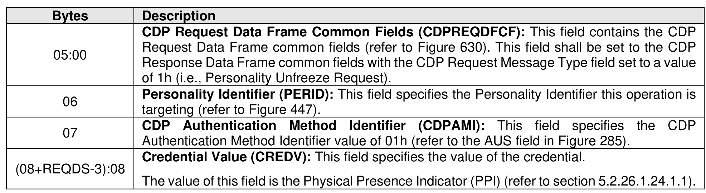

###### 8.1.6.2.1.2.1 CDP Physical Credential Authentication Unfreeze Request Data

> **Section ID**: 8.1.6.2.1.2.1 | **Page**: 565-565

Figure 634 specifies the Request Data for a Personality Unfreeze Request operation using Physical
Credential Authentication (refer to the AUS field in Figure 285).

---
### 📊 Tables (1)

#### Table 1: Untitled Table

541

