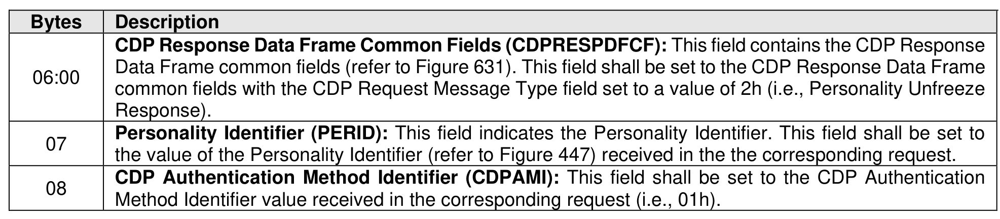

###### 8.1.6.2.1.2.2 CDP Physical Credential Authentication Unfreeze Response Data

> **Section ID**: 8.1.6.2.1.2.2 | **Page**: 566-566

Figure 635 specifies the Response Data for a Personality Unfreeze Request operation using Physical
Credential Authentication (refer to the AUS field in Figure 285).

---
### 📊 Tables (1)

#### Table 1: Untitled Table

| | |
| :--- | :--- |
| | common fields with the CDP Request Message Type field set to a value of 2h (i.e., Personality Unfreeze Response). |
| **Personality Identifier (PERID):** This field indicates the Personality Identifier. This field shall be set to the value of the Personality Identifier (refer to Figure 447) received in the the corresponding request. | |
| **CDP Authentication Method Identifier (CDPAMI):** This field shall be set to the CDP Authentication Method Identifier value received in the corresponding request (i.e., 01h). | |

