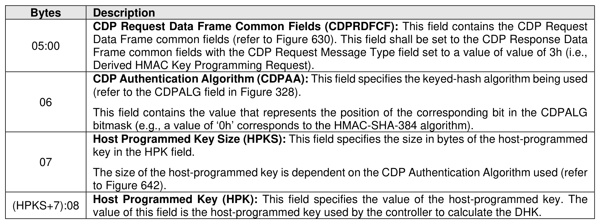

###### 8.1.6.2.1.3.1 CDP Derived HMAC Key Programming Request Data

> **Section ID**: 8.1.6.2.1.3.1 | **Page**: 566-566

Figure 636 specifies the contents of the Request Data field for a Derived HMAC Key Programming
operation.

---
### 📊 Tables (1)

#### Table 1: Untitled Table

| | Description |
|:---|:---|
| | CDP Response Data Frame Common Fields (CDPRESPDFCF): This field contains the CDP Response Data Frame common fields (refer to Figure 631). This field shall be set to the CDP Response Data Frame common fields with the CDP Request Message Type field set to a value of 4h (i.e., Derived HMAC Key Programming Response). |
| | This field contains the value that represents the position of the corresponding bit in the CDPALG bitmask (e.g., a value of '0h' corresponds to the HMAC-SHA-384 algorithm). |
| | **Host Programmed Key Size (HPKS):** This field specifies the size in bytes of the host-programmed key in the HPK field. The size of the host-programmed key is dependent on the CDP Authentication Algorithm used (refer to Figure 642). |
| | **Host Programmed Key (HPK):** This field specifies the value of the host-programmed key. The value of this field is the host-programmed key used by the controller to calculate the DHK. |

