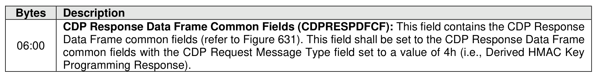

###### 8.1.6.2.1.3.2 CDP Derived HMAC Key Programming Response Data

> **Section ID**: 8.1.6.2.1.3.2 | **Page**: 566-566

Figure 633 specifies the Response Data for a Derived HMAC Key Programming operation using
Programmable Key Authentication (refer to the AUS field in Figure 285). The Derived HMAC Key
Programming operation does not include specific Response Data.

---
### 📊 Tables (1)

#### Table 1: Untitled Table

| | 2023 | 2022 | 2021 |
| :--- | :--- | :--- | :--- |
| **Total assets** | $1,000,000 | $900,000 | $800,000 |
| **Total liabilities** | $600,000 | $550,000 | $500,000 |
| **Net income** | $150,000 | $120,000 | $100,000 |
| **Revenue** | $500,000 | $450,000 | $400,000 |
| **Total equity** | $400,000 | $350,000 | $300,000 |

