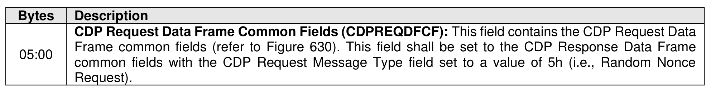

###### 8.1.6.2.1.4.1 CDP Random Nonce Request Data

> **Section ID**: 8.1.6.2.1.4.1 | **Page**: 566-567

Figure 638 specifies the contents of the CDP Request Data Frame field for a Random Nonce Request
operation. The Random Nonce Request operation does not include specific Request Data.

---
### 📊 Tables (1)

#### Table 1: Untitled Table

| Frame common fields (refer to Figure 630). This field shall be set to the CDP Response Data Frame common fields with the CDP Request Message Type field set to a value of 5h (i.e., Random Nonce Request). |
|---|
| .4.2 CDP Random Nonce Response Data |
| 39 specifies the Response Data for a Random Nonce Request operation. |

