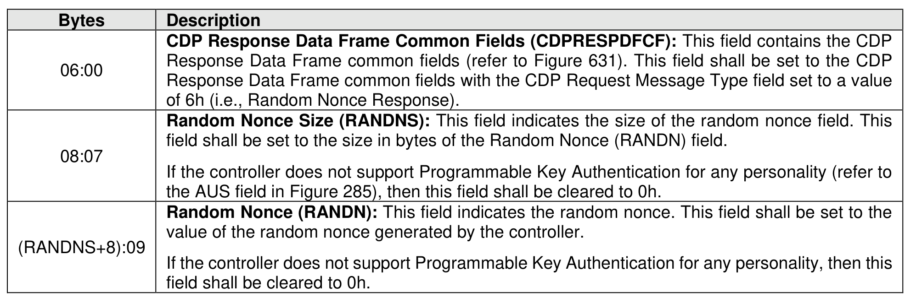

###### 8.1.6.2.1.4.2 CDP Random Nonce Response Data

> **Section ID**: 8.1.6.2.1.4.2 | **Page**: 567-567

Figure 639 specifies the Response Data for a Random Nonce Request operation.

---
### 📊 Tables (1)

#### Table 1: Untitled Table

| :07 | Random Nonce Size (RANDNS): This field indicates the size of the random nonce field. This field shall be set to the size in bytes of the Random Nonce (RANDN) field. If the controller does not support Programmable Key Authentication for any personality (refer to the AUS field in Figure 285), then this field shall be cleared to 0h. |
| :09 | Random Nonce (RANDN): This field indicates the random nonce. This field shall be set to the value of the random nonce generated by the controller. If the controller does not support Programmable Key Authentication for any personality, then this field shall be cleared to 0h. |

