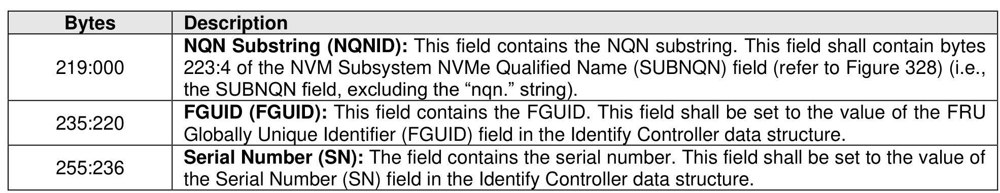
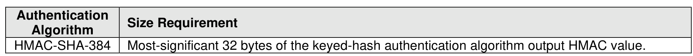

###### 8.1.6.3.1.1 Key Derivation

> **Section ID**: 8.1.6.3.1.1 | **Page**: 570-571

The Derived HMAC Key (DHK) shall be derived by applying a secure keyed-hash function (refer to the
CDPALG field in Figure 328) to:
•
the CDP Subsystem Unique String as defined in Figure 654; and
•
the host-specified value of the key (i.e., the key specified in the Host Programmed Key field in the
Security Send command payload),
as the inputs to the secure keyed-hash function. If an authentication method is supported (refer to the AUS
field in Figure 285), then the FGUID field as defined in Figure 328 shall be supported.
The CDP Subsystem Unique String is shown in Figure 654. That string is used by the controller for deriving
the DHK that is unique to the NVM subsystem.
The DHK is derived using a keyed-hash authentication algorithm (refer to the CDPALG field in Figure 328),
whose output is the DHK that is stored in the NVM subsystem for subsequent usage during Personality
Unfreeze Request operations (refer to section 8.1.6.2.1). The required DHK sizes are specified in Figure
642.
Once the DHK has been successfully derived, the controller shall purge (refer to IEEE Std 2883) all copies
of the key that was specified by the host for the Derived HMAC Key Programming operation.
The host should derive the DHK specified in Personality Unfreeze Request operations as described in this
section.
The DHK stored in the NVM subsystem shall be purged by the controller as part of the NVM subsystem
being successfully configured with Manufacturing Default Personality.

---
### 📊 Tables (2)

#### Table 1: Untitled Table

| 346 |
|---|
| e DHK has been successfully derived, the controller shall purge (refer to IEEE Std 2883) all copies |
| y that was specified by the host for the Derived HMAC Key Programming operation. |
| t should derive the DHK specified in Personality Unfreeze Request operations as described in this |

#### Table 2: Untitled Table

(Continuation of Untitled Table - see first part)

