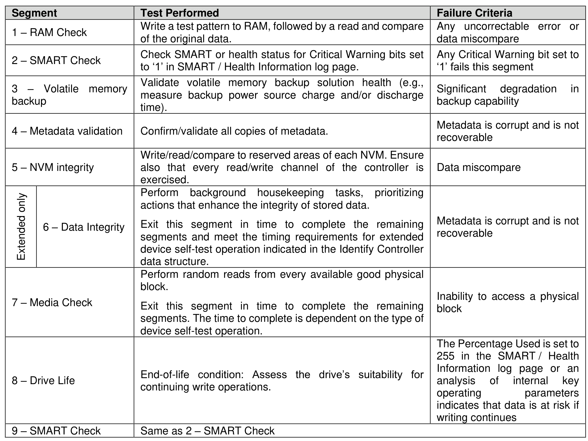

#### 8.1.8 Device Self-test Operations

> **Section ID**: 8.1.8 | **Page**: 573-574

A device self-test operation is a diagnostic testing sequence that tests the integrity and functionality of the
controller and may include testing of the media associated with namespaces or refresh operations. The
operation is broken down into a series of segments, where each segment is a set of vendor specific tests
or refresh operations. The segment number in the Self-test Result data structure (refer to section 5.2.12.1.7)
is used for reporting purposes to indicate where a test failed, if any. The test performed in each segment
may be the same for the short device self-test operation and the extended device self-test operation.
A device self-test operation is performed in the background allowing concurrent processing of some
commands and requiring suspension of the device self-test operation to process other commands. Which
commands may be processed concurrently versus require suspension of the device self-test operation is
vendor specific.
If the controller receives any command that requires suspension of the device self-test operation to process
and complete, then the controller shall:
During a device self-test operation, the performance of the NVM subsystem may be degraded (e.g.,
controllers not performing the device self-test operation may also experience degraded performance).
The following device self-test operations are defined:
a) short device self-test operation (refer to section 8.1.8.1);
b) extended device self-test operation (refer to section 8.1.8.2); and
c) Host-Initiated Refresh operation (refer to section 8.1.12).
Figure 643 is an informative example of a device self-test operation with the associated segments and tests
performed in each segment.

---
### 📊 Tables (1)

#### Table 1: Untitled Table

| | | |
| :--- | :--- | :--- |
| AM Check | Write a test pattern to NVM, followed by a read and compare of the original data. | Any 'uncorrectable' error or data miscompare |
| SMART Check | Check SMART or health status for Critical Warning bits set to '1' in SMART / Health Information log page. | Any Critical Warning bit set to '1' fails this segment |
| Volatile memory backup | Validate volatile memory backup solution health (e.g., measure backup power source charge and/or discharge time). | Significant degradation in backup capability |
| Metadata validation | Confirm/validate all copies of metadata. | Metadata is corrupt and is not recoverable |
| NVM integrity | Write/read/compare to reserved areas of each NVM. Ensure also that every read/write channel of the controller is exercised. | Data miscompare |
| 6 – Data Integrity | Perform background housekeeping tasks, prioritizing actions that enhance the integrity of stored data.   Exit this segment in time to complete the remaining segments and meet the timing requirements for extended device self-test operation indicated in the Identify Controller data structure. | Metadata is corrupt and is not recoverable |
| Media Check | Perform random reads from every available good physical block.   Exit this segment in time to complete the remaining segments. The time to complete is dependent on the type of device self-test operation. | Inability to access a physical block |
| End-of-life | End-of-life condition: Assess the drive's suitability for continuing write operations. | The Percentage Used is set to 255 in the SMART / Health Information log page or an analysis of internal key operating parameters indicates that data is at risk if writing continues |
| SMART Check | Same as 2 – SMART Check | |

