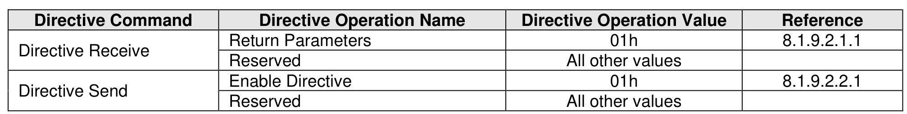

##### 8.1.9.2 Identify (Directive Type 00h)

> **Section ID**: 8.1.9.2 | **Page**: 577-577

The Identify Directive is used to determine the Directive Types that the controller supports and to enable
use of the supported Directives. If Directives are supported, then this Directive Type shall be supported.
The Directive operations that shall be supported for the Identify Directive are listed in Figure 647.

---
### 📊 Tables (1)

#### Table 1: Untitled Table

| | | | |
| :--- | :--- | :--- | :--- |
| | | | |
| | | | |
| | | | |
| | | | |
| | | | |
| | | | |

