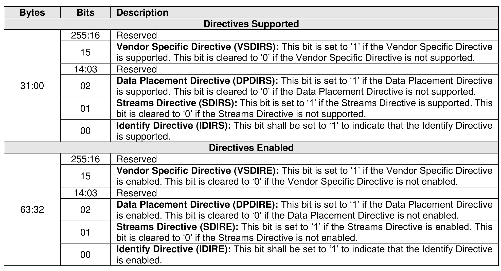
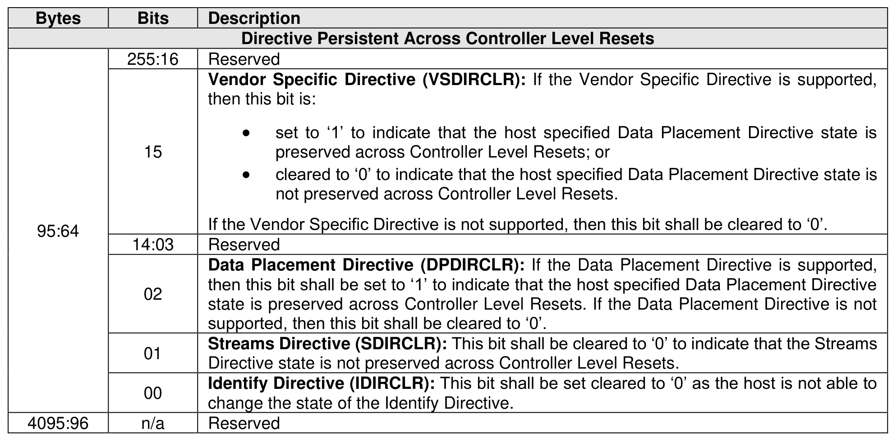

###### 8.1.9.2.1.1 Return Parameters (Directive Operation 01h)

> **Section ID**: 8.1.9.2.1.1 | **Page**: 577-578

This operation returns a data structure that contains a bit vector specifying the Directive Types supported
by the controller and a bit vector specifying the Directive Types enabled for the namespace. The data
structure returned is defined in Figure 648. If an NSID value of FFFFFFFFh is specified, then the controller
shall abort the command with a status code of Invalid Field in Command. The DSPEC field in command
Dword 11 is not used for this operation.

---
### 📊 Tables (2)

#### Table 1: Untitled Table

| | | |
|:---|:---|:---|
| | | **Directives Enabled** |
| 255:16 | Reserved | |
| 15 | **Vendor Specific Directive (VSDIRE):** This bit is set to '1' if the Vendor Specific Directive is enabled. This bit is cleared to '0' if the Vendor Specific Directive is not enabled. | |
| 14:03 | Reserved | |
| 02 | **Data Placement Directive (DPDIRE):** This bit is set to '1' if the Data Placement Directive is enabled. This bit is cleared to '0' if the Data Placement Directive is not enabled. | |
| 01 | **Streams Directive (SDIRE):** This bit is set to '1' if the Streams Directive is enabled. This bit is cleared to '0' if the Streams Directive is not enabled. | |
| 00 | **Identify Directive (IDIRE):** This bit shall be set to '1' to indicate that the Identify Directive is enabled. | |
| | | |
| | | |
| | | |
| | | |
| | | |
| | | |
| | | |
|

#### Table 2: Untitled Table

(Continuation of Untitled Table - see first part)

