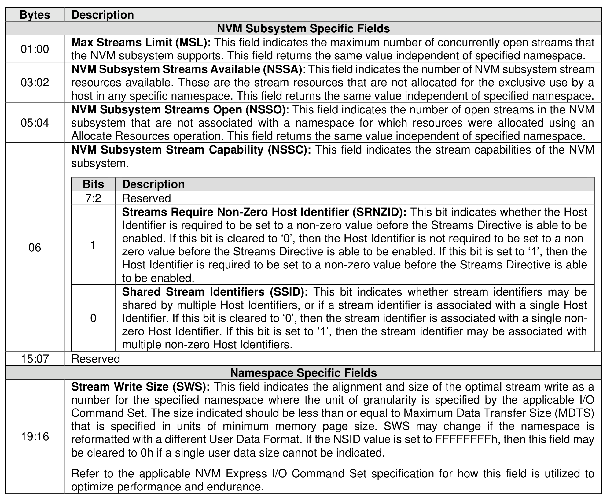
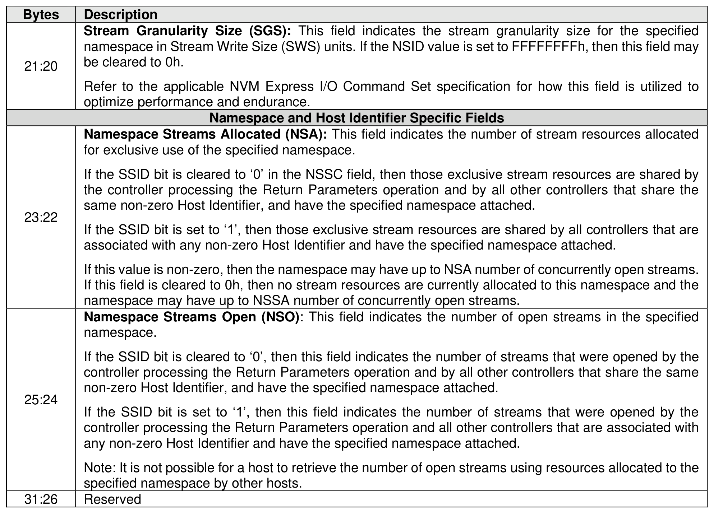

###### 8.1.9.3.1.1 Return Parameters (Directive Operation 01h)

> **Section ID**: 8.1.9.3.1.1 | **Page**: 583-584

The Return Parameter operation returns a data structure that specifies the features and capabilities
supported by the Streams Directive, including namespace specific values. The DSPEC field in command
Dword 11 is not used for this operation. The data structure returned is defined in Figure 655. If an NSID
value of FFFFFFFFh is specified, then the controller:
•
returns the NVM subsystem specific values;
•
may return any namespace specific values that are the same for all namespaces (e.g., SWS); and
•
clears all other namespace specific fields to 0h.

---
### 📊 Tables (2)

#### Table 1: Untitled Table

| Bits | Description |
|:---|:---|
| 7:2 | Reserved |
| 1 | **Streams Require Non-Zero Host Identifier (SRNZID):** This bit indicates whether the Host Identifier is required to be set to a non-zero value before the Streams Directive is able to be enabled. If this bit is cleared to '0', then the Host Identifier is not required to be set to a non-zero value before the Streams Directive is able to be enabled. If this bit is set to '1', then the Host Identifier is required to be set to a non-zero value before the Streams Directive is able to be enabled. |
| 0 | **Shared Stream Identifiers (SSID):** This bit indicates whether stream identifiers may be shared by multiple Host Identifiers, or if a stream identifier is associated with a single Host Identifier. If this bit is cleared to '0', then the stream identifier is associated with a single non-zero Host Identifier. If this bit is set to '1', then the stream identifier may be associated with multiple non-zero Host Identifiers. |
| | Reserved |
| | **Namespace Specific Fields** |
| | **Stream Write Size (SWS):** This field indicates the alignment and size of the optimal stream write as a number for the specified namespace where the unit of granularity is specified by the applicable I/O Command Set. The size indicated should be less than or equal to Maximum Data Transfer Size (MDTS) that is specified in units of minimum memory page size. SWS may change if the namespace is reformatted with a different User Data Format. If the NSID value is set to FFFFFFFFh, then this field may be cleared to 0h if a single user data size cannot be indicated. |
| | Refer to the applicable NVM Express I/O Command Set specification for how this field is utilized to optimize performance and endurance. |
| | **Namespace and Host Identifier Specific Fields** |
| | **Namespace Streams Allocated (NSA):** This field indicates the number of stream resources allocated for exclusive use of the specified namespace. |
| | If the SSID bit is cleared to '0' in the NSSC field, then those exclusive stream resources are shared by the controller processing the Return Parameters operation and by all other controllers that share the same non-zero Host Identifier, and have the specified namespace attached. |
| | If the SSID bit is set to '1', then those exclusive stream resources are shared by all controllers that are associated with any non-zero Host Identifier and have the specified namespace attached. |
| | If this value is non-zero, then the namespace may have up to NSA number of concurrently open streams. If this field is cleared to 0h, then no stream resources are currently allocated to this namespace and the namespace may have up to NSAA number of concurrently open streams. |
| | **Namespace Streams Open (NSO):** This field indicates the number of open streams in the specified namespace. |
| | If the SSID bit is cleared to '0', then this field indicates the number of streams that were opened by the controller processing the Return Parameters operation and by all other controllers that share the same non-zero Host Identifier, and have the specified namespace attached. |
| | If the SSID bit is set to '1', then this field indicates the number of streams that were opened by the controller processing the Return Parameters operation and all other controllers that are associated with any non-zero Host Identifier and have the specified namespace attached. |
| | Note: It is not possible for a host to retrieve the number of open streams using resources allocated to the specified namespace by other hosts. |
| | Reserved |

#### Table 2: Untitled Table

(Continuation of Untitled Table - see first part)

