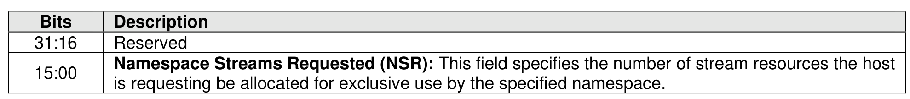
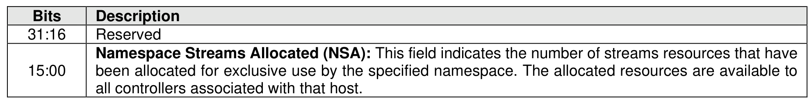

###### 8.1.9.3.1.3 Allocate Resources (Directive Operation 03h)

> **Section ID**: 8.1.9.3.1.3 | **Page**: 585-585

The Allocate Resources operation indicates the number of streams that the host requests for the exclusive
use for the specified namespace. If the SSID bit is cleared to ‘0’ in the NSSC field, then those resources
are for the exclusive use of hosts that are registered with the same Host Identifier as the host that made
the request. If the SSID bit is set to ‘1’, then those resources are for the exclusive use of any host that is
registered with any non-zero Host Identifier. The DSPEC field in command Dword 11 is not used for this
operation. The operation returns the number of streams allocated in Dword 0 of the completion queue entry.
The value allocated may be less than or equal to the number requested. The allocated resources shall be
reflected in the Namespace Streams Allocated field of the Return Parameters data structure.
If the controller is unable to allocate any stream resources for the exclusive use for the specified
namespace, then the controller shall:
•
return a status value of Stream Resource Allocation Failed; or
•
if NVM subsystem stream resources are available, then clear NSA to 0h in the completion queue
entry to indicate that the host may use stream resources from the NVM subsystem for this
namespace.
If the specified namespace already has stream resources allocated for the exclusive use of the host issuing
the Allocate Resources operation, then the controller shall return a status code of Invalid Field in Command.
To allocate additional streams resources, the host should release resources and request a complete set of
resources.
No data transfer occurs.

---
### 📊 Tables (2)

#### Table 1: Untitled Table

|  |  |
| :--- | :--- |
| 3.2 Directive Send |  |
| This section defines operations used with the Directive Send command for the Streams Directive. |  |
| 3.2.1 Release Identifier (Directive Operation 01h) |  |
| 561 |  |

#### Table 2: Untitled Table

(Continuation of Untitled Table - see first part)

