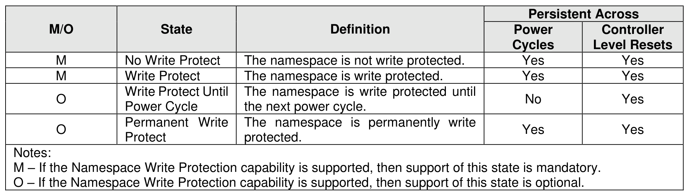

#### 8.1.17 Namespace Write Protection

> **Section ID**: 8.1.17 | **Page**: 608-609

Namespace Write Protection is an optional configurable controller capability that enables the host to control
the write protection state of a namespace or to determine the write protection state of a namespace. Support
for this capability is reported in the Namespace Write Protection Capabilities (NWPC) field in the Identify
Controller data structure (refer to Figure 328).
Figure 669 defines the write protection states that may be supported for a namespace. All states persist
across power cycles and Controller Level Resets (refer to section 3.7.2) except Write Protect Until Power
Cycle state, which transitions to the No Write Protect state on the occurrence of a power cycle.
The Write Protect Until Power Cycle state shall not be used in multi-domain NVM subsystems because
clearing that state requires simultaneous power cycle of the namespace and all controllers to which that
namespace is attached. The result of a command that attempts to use that state in a multi-domain NVM
subsystem is specified in section 5.2.26.1.35.
Figure 670 defines the transition between write protection states. All state transitions are based on Set
Features commands unless otherwise specified. The initial state of a namespace at the time of its creation
is the No Write Protect state.
The Write Protect Until Power Cycle and Permanent Write Protect states are subject to the controls defined
in the Write Protection Control field (refer to Figure 690), which determines whether the controller processes
or aborts Set Features commands which cause a transition into either of these two states (refer to section
8.1.23).
The results of using Namespace Write Protection in combination with an external write protection system
(e.g., TCG Storage Interface Interactions Specification) are outside the scope of this specification.

---
### 📊 Tables (1)

#### Table 1: Untitled Table

| | | | **Cycles** | **Level Resets** |
|---|---|---|---|---|
| | No Write Protect | The namespace is not write protected. | Yes | Yes |
| | Write Protect | The namespace is write protected. | Yes | Yes |
| | Write Protect Until Power Cycle | The namespace is write protected until the next power cycle. | No | Yes |
| | Permanent Write Protect | The namespace is permanently write protected. | Yes | Yes |
| | | | | |
| | | | | |
| | | | | |
| | | | | |
| | | | | |

