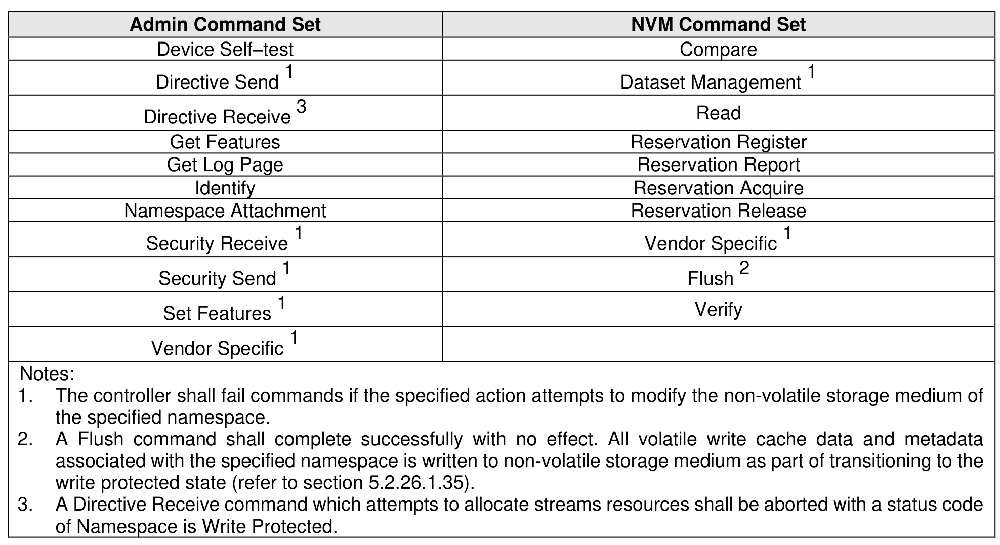

##### 8.1.17.2 Namespace Write Protection – Command Interactions

> **Section ID**: 8.1.17.2 | **Page**: 610-610

Unless otherwise noted, the commands listed in Figure 671 are processed normally when specifying an
NSID for a namespace that is write protected.
Commands not listed in Figure 671, and which meet the following conditions, shall be aborted with a status
code of Namespace Is Write Protected (refer to Figure 102):
a) Commands that specify an NSID for a namespace that is write protected;
b) Commands that specify an NSID for a namespace that is not write protected and the execution of
which would modify another namespace that is write protected (e.g., a Format NVM command);
and
c) Commands that do not specify an NSID, and the execution of which would modify a namespace
that is write protected (e.g., Sanitize command).

---
### 📊 Tables (1)

#### Table 1: Untitled Table

| | | | | | | | | | | | | | | | | | | | | | | | | | | | | | |

