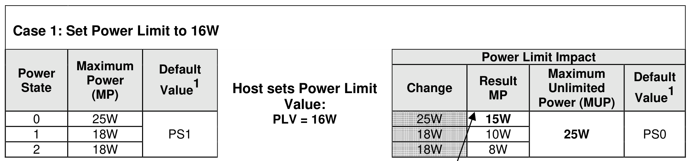
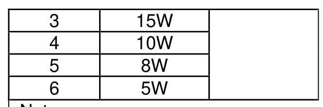
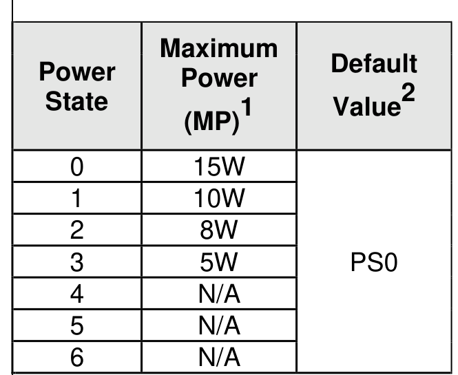
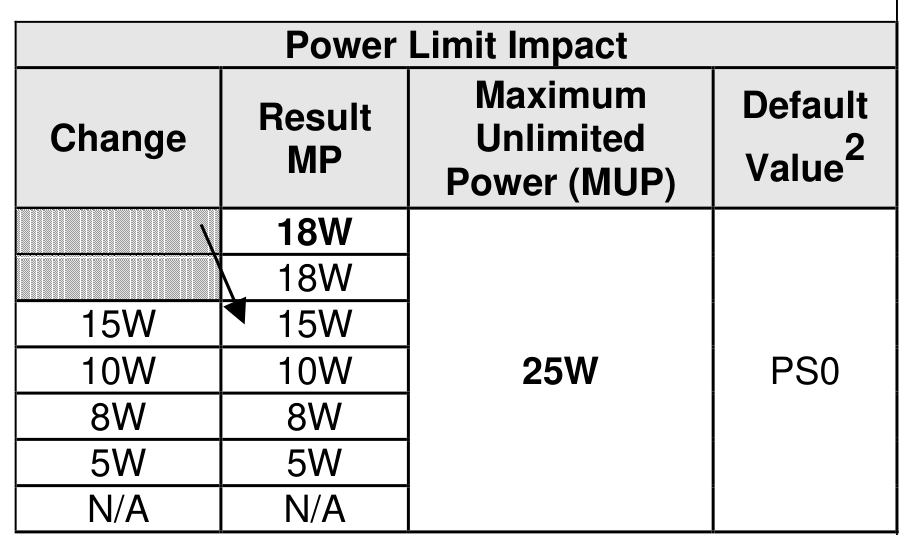
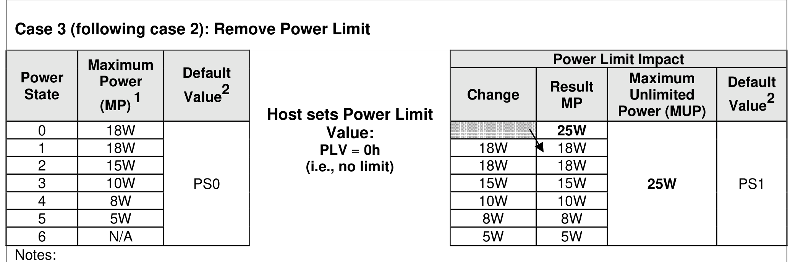

###### 8.1.18.6.4 Power Limit Effects Examples

> **Section ID**: 8.1.18.6.4 | **Page**: 619-621

Figure 676, Figure 677, and Figure 678 provide examples of the effects of setting, changing and removing
a power limit based on the power states used in Figure 673 in section 8.1.18. The default power state is
initially PS1, the first of the two power states whose maximum power is 18W.
Case 1 in Figure 676 shows the effects of setting an initial power limit of 16W when there is no power limit:
•
The first three power states (PS0, PS1, and PS2) become prohibited and their descriptors are
removed because their maximum power values are greater than 16W;
•
The power state descriptor data structures for the four power states that remain are shifted by three
power state descriptor slots to lower byte offsets and renumbered (e.g., PS3 is renumbered to
become PS0, as the 15W MP value for the original PS3 is now the maximum power that is able to
be consumed by the NVM subsystem if all controllers are in that power state);
•
The 0’s based NPSS value in Identify Controller decreases from 6 to 3 to indicate that there are
now four available power states;
•
The default value of the Power Management feature (i.e., Feature Identifier 02h) changes to PS0;
and
•
If the current controller power state is PS0, PS1, or PS2 when the 16W power limit is set, then the
controller transitions to the new PS0, otherwise the controller remains in the same power state and
the current value of the Power Management feature is decreased by 3 to indicate the new number
of that power state (e.g., the 10W PS4 state becomes PS1).
Case 2 in Figure 677 shows the effects of subsequently raising the 16W power limit to 20W:
•
The power state descriptor data structures for the four power states that are initially enabled for
use are shifted by two PSD slots to higher byte offsets and renumbered (e.g., PS0 is renumbered
to become PS2). This creates two empty power state descriptor slots for the two power states
whose descriptors are restored;
•
The descriptors for the former PS1 and PS2 18W power states are restored and those power states
are enabled for use because their maximum power values are less than 20W. Those two power
states are renumbered to PS0 and PS1. The original 25W PS0 remains prohibited (and its
descriptor remains removed) because its maximum power is greater than 20W. The 18W MP value
for the resulting PS0 is now the maximum power;
•
The 0’s based NPSS value in Identify Controller increases from 3 to 5 to indicate that there are now
six power states that are enabled for use;
•
The controller power state does not change, but the current value of the Power Management
feature (i.e., Feature Identifier 02h) is increased by 2 to match the power state renumbering (e.g.,
the 15W PS0 becomes PS2); and
•
The default value of the Power Management feature changes to PS0 as that is the current position
of the PSD for the original PS1 default power state.
otes
1.
The listed MP represent the values in the modified power state descriptor data structures after case 1 completed
successfully.
2.
The default value of the Power Management feature (i.e., Feature Identifier 02h).
Case 3 in Figure 678 shows the effects of subsequently removing the 20W power limit:
•
The power state descriptor data structures for the six power states that are initially enabled for use
are shifted by one power state descriptor slot to higher byte offsets and renumbered (e.g., PS0 is
renumbered to become PS1). This creates an empty power state descriptor slot for the power state
whose descriptor is restored;
•
The original PSD0 is restored and that power state is enabled as PS0 because the power limit has
been removed;
•
The 0’s based NPSS value in Identify Controller increases from 5 to 6 to indicate that there are now
seven power states that are enabled for use;
•
The controller power state does not change, but the value of the Power Management feature (i.e.,
Feature Identifier 02h) is increased by 1 to match the power state renumbering (e.g., the 15W PS2
state becomes PS3); and
•
The default value of the Power Management feature is restored to PS1 as that is the current position
of the power state descriptor for original PS1 default power state.

---
### 📊 Tables (6)

#### Table 1: Untitled Table

| Maximum Power (MP)¹ | Default Value² | | Change | Result MP | Maximum Unlimited Power (MUP) | Default Value² |
| :--- | :--- | :--- | :--- | :--- | :--- | :--- |
| | | Host sets Power Limit Value: PLV = 0h (i.e., no limit) | | | | |
| 18W | PS0 | | 25W | | | |
| 18W | | | 18W | 18W | 25W | PS1 |
| 15W | | | 18W | 18W | | |
| 10W | | | 15W | 15W | | |
| 8W | | | 10W | 10W | | |
| 5W | | | 8W | 8W | | |
| N/A | | | 5W | 5W | | |

#### Table 2: Untitled Table

(Continuation of Untitled Table - see first part)

#### Table 3: Untitled Table

(Continuation of Untitled Table - see first part)

#### Table 4: Untitled Table

(Continuation of Untitled Table - see first part)

#### Table 5: Untitled Table

(Continuation of Untitled Table - see first part)

#### Table 6: Untitled Table

(Continuation of Untitled Table - see first part)

