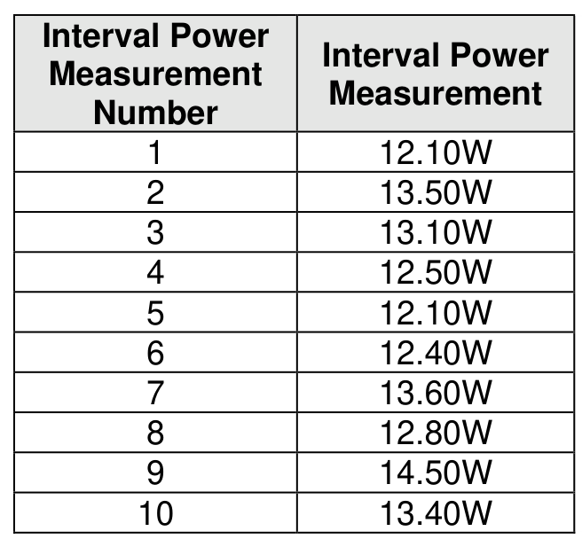
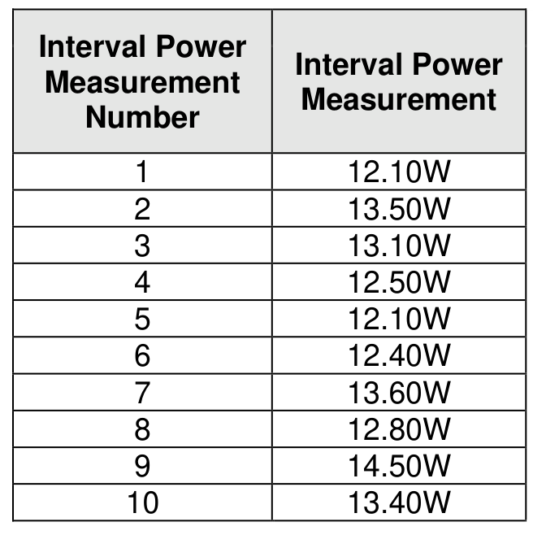
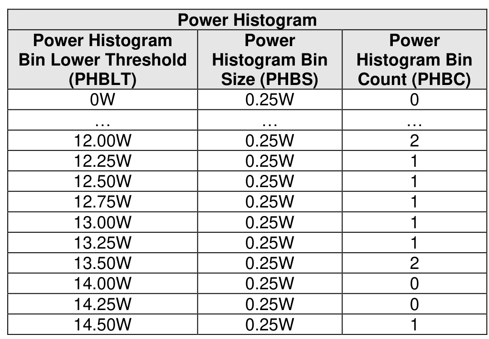

##### 8.1.19.2 Power Measurement Examples (Informative)

> **Section ID**: 8.1.19.2 | **Page**: 624-625

This section includes several power measurement examples for the Power Measurement log page. Figure
682 shows an example set of 10 interval power measurements and how those measurements can be used
to calculate the Average Interval Power and the Maximum Interval Power.
Figure 683 shows an example set of 10 interval power measurements and how those measurements can
be used to generate a power histogram.
Figure 684 shows the formula for percent error of power measurements.

---
### 📊 Tables (4)

#### Table 1: Untitled Table

| Number | Measurement |
|---|---|
| 1 | 12.10W |
| 2 | 13.50W |
| 3 | 13.10W |
| 4 | 12.50W |
| 5 | 12.10W |
| 6 | 12.40W |
| 7 | 13.60W |
| 8 | 12.80W |
| 9 | 14.50W |
| 0 | 13.40W |
| 4 | 12.50W |
| 5 | 12.10W |
| 6 | 12.40W |
| 7 | 13.60W |
| 8 | 12.80W |
| 9 | 14.50W |
| 0 | 13.40W |

#### Table 2: Untitled Table

(Continuation of Untitled Table - see first part)

#### Table 3: Untitled Table

(Continuation of Untitled Table - see first part)

#### Table 4: Untitled Table

(Continuation of Untitled Table - see first part)

