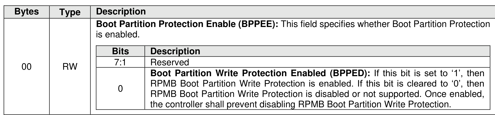
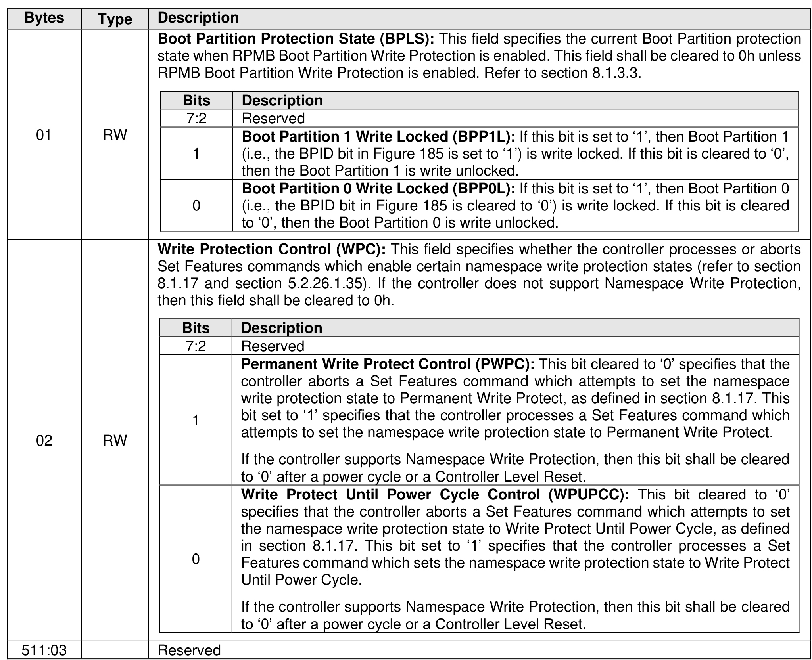
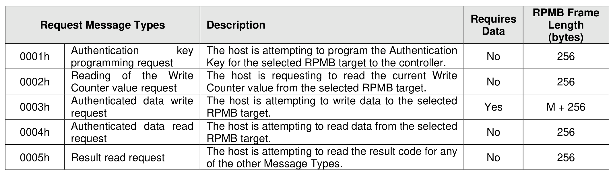
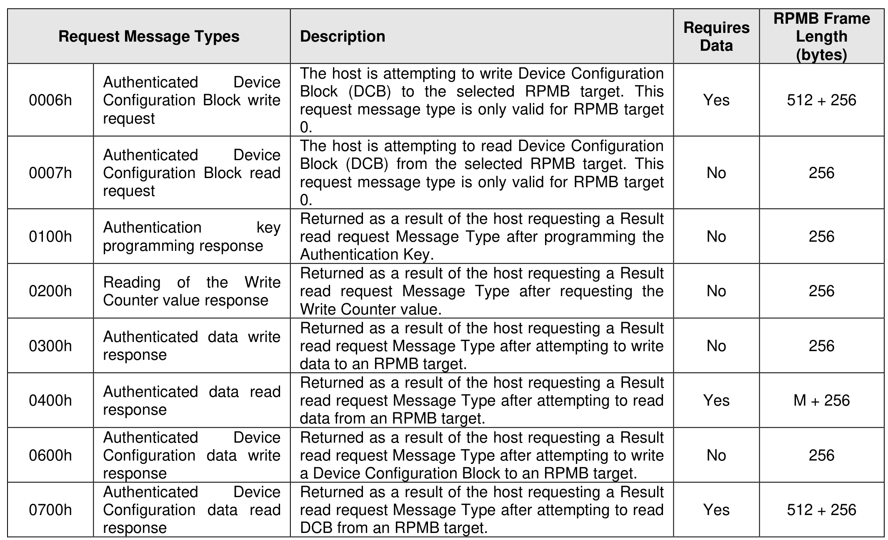
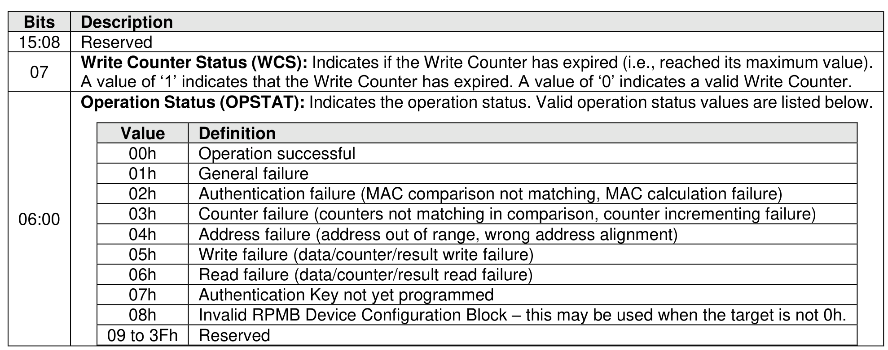
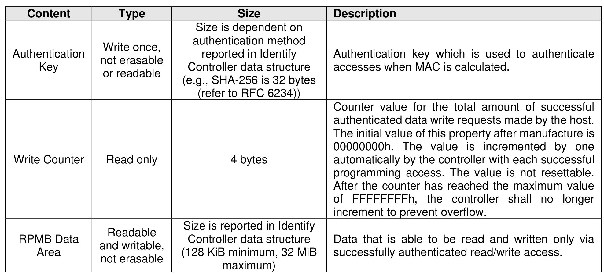
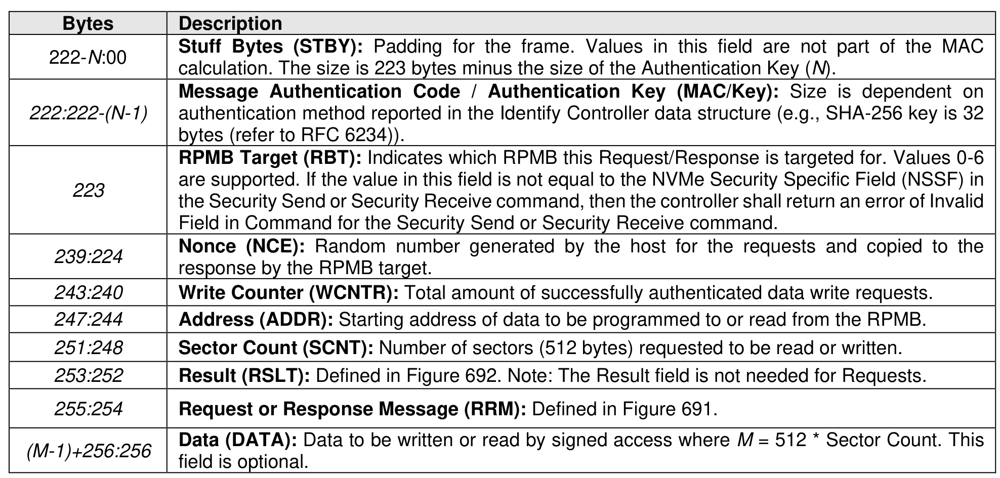

#### 8.1.23 Replay Protected Memory Block

> **Section ID**: 8.1.23 | **Page**: 633-637

The Replay Protected Memory Block (RPMB) provides a means for the system to store data to a specific
memory area in an authenticated and replay protected manner. This is provided by first programming
authentication key information to the controller that is used as a shared secret. The system is not
authenticated in this phase, therefore the authentication key programming should be done in a secure
environment (e.g., as part of the manufacturing process). The authentication key is utilized to sign the read
and write accesses made to the replay protected memory area with a Message Authentication Code (MAC).
Use of random number (nonce) generation and a write count property provide additional protection against
replay of messages where messages could be recorded and played back later by an attacker.
Any attempt to access the replay protected memory area prior to the Authentication Key being programmed
results in an RPMB Operation Result Operation Status field set to 07h (i.e., Authentication Key not yet
programmed) (refer to Figure 692). Once the key is programmed, the RPMB Operation Result Operation
Status field shall not be set to 07h.
An Authenticated Data Write to the RPMB Device Configuration Block data structure that attempts to set
the Boot Partition Write Protection Enabled bit when RPMB Boot Partition Write Protection is not supported
results in an RPMB Operation Result Operation Status of 05h (i.e., Write failure in the RPMB Operation
Status field) (refer to Figure 692).
An Authenticated Data Write to the RPMB Device Configuration Block data structure that attempts to set
the Boot Partition Write Protection Enabled bit when either Boot Partition is in the Write Locked Until Power
Cycle state (refer to section 5.2.26.1.36 and section 8.1.3.3.1) results in an RPMB Operation Result
Operation Status of 05h (i.e., Write failure in the RPMB Operation Status field) (refer to Figure 692).
An Authenticated Data Write to the RPMB Device Configuration Block data structure that attempts to
change either the Boot Partition 0 Write Locked bit or the Boot Partition 1 Write Locked bit when the Boot
Partition Write Protection Enabled bit is cleared to ‘0’ results in an RPMB Operation Result Operation Status
field set to 05h (i.e., Write failure) (refer to Figure 692).
If Set Features Boot Partition Write Protection is supported, then an Authenticated Data Write to the RPMB
Device Configuration Block data structure that successfully enables RPMB Boot Partition Write Protection
shall also result in the controller changing the Boot Partition 0 Write Protection State and Boot Partition 1
Write Protection State values in the Boot Partition Write Protection Config feature to a value of 100b to
indicate that Boot Partition write protection is controlled by RPMB.
The controller may support multiple RPMB targets. RPMB targets are not contained within a namespace.
Controllers in the NVM subsystem may share the same RPMB targets. Security Send and Security Receive
commands for RPMB do not use the namespace ID field; NSID shall be cleared to 0h. Each RPMB target
operates independently – there may be requests outstanding to multiple RPMB targets at once (where the
requests may be interleaved between RPMB targets). In order to guarantee ordering the host should issue
and wait for completion for one Security Send or Security Receive command at a time. Each RPMB target
requires individual authentication and key programming. Each RPMB target may have its own unique
Authentication Key.
The message types defined in Figure 691 are used by the host to communicate with an RPMB target.
Request Message Types are sent from the host to the controller using Security Send commands. Response
Message Types are retrieved by the host from the controller using Security Receive commands.
Figure 690 defines the RPMB Device Configuration Block data structure – the non-volatile contents stored
within the controller for RPMB target 0.
The operation result defined in Figure 692 indicates whether an RPMB request was successful or not.
Each RPMB Data Frame is 256 bytes in size plus the size of the Data field, and is organized as shown in
Figure 694. RPMB uses a sector size of 512 bytes. The RPMB sector size is independent and not related
to the user data size used for the namespace(s).
Security Send and Security Receive commands are used to encapsulate and deliver data packets of any
security protocol between the host and controller without interpreting, dis-assembling or re-assembling the
data packets for delivery. Security Send and Security Receive commands used for RPMB access are
populated with the RPMB Data Frame(s) defined in Figure 694. The controller shall not return successful
completion of a Security Send or Security Receive command for RPMB access until the requested RPMB
Request/Response Message Type indicated is completed. The Security Protocol used for RPMB is defined
in section 5.2.24.3.

---
### 📊 Tables (7)

#### Table 1: Untitled Table

| | | | | |
| :--- | :--- | :--- | :--- | :--- |
| | **Bits** | **Description** | | |
| | 7:2 | Reserved | | |
| | 1 | **Boot Partition 1 Write Locked (BPP1L)**: If this bit is set to '1', then Boot Partition 1 (i.e., the BPID bit in Figure 185 is set to '1') is write locked. If this bit is cleared to '0', then the Boot Partition 1 is write unlocked. | | |
| | 0 | **Boot Partition 0 Write Locked (BPP0L)**: If this bit is set to '1', then Boot Partition 0 (i.e., the BPID bit in Figure 185 is cleared to '0') is write locked. If this bit is cleared to '0', then the Boot Partition 0 is write unlocked. | | |
| | | | | |
| | **Bits** | **Description** | | |
| | 7:2 | Reserved | | |
| | 1 | **Permanent Write Protect Control (PWPC)**: This bit cleared to '0' specifies that the controller aborts a Set Features command which attempts to set the namespace write protection state to Permanent Write Protect, as defined in section 8.1.17. This bit set to '1' specifies that the controller processes a Set Features command which attempts to set the namespace write protection state to Permanent Write Protect. If the controller supports Namespace Write Protection, then this bit shall be cleared to '0' after a power cycle or a Controller Level Reset. | | |
| | 0 | **Write Protect Until Power Cycle Control (WPUPCC)**: This bit cleared to '0' specifies that the controller aborts a Set Features command which attempts to set the namespace write protection state to Write Protect Until Power Cycle, as defined in section 8.1.17. This bit set to '1' specifies that the controller processes a Set Features command which sets the namespace write protection state to Write Protect Until Power Cycle. If the controller supports Namespace Write Protection, then this bit shall be cleared to '0' after a power cycle or a Controller Level Reset. | | |
| | | Reserved | | |
| | | | | |
| | | | | |
| | | | | |
| | | | | |
| | | |
| Request message type | Description | Data | Length (bytes) |
| :--- | :--- | :--- | :--- |
| Authenticated Device Configuration Block write request | The host is attempting to write Device Configuration Block (DCB) to the selected RPMB target. This request message type is only valid for RPMB target 0. | Yes | 512 + 256 |
| Authenticated Device Configuration Block read request | The host is attempting to read Device Configuration Block (DCB) from the selected RPMB target. This request message type is only valid for RPMB target 0. | No | 256 |
| Authentication key programming response | Returned as a result of the host requesting a Result read request Message Type after programming the Authentication Key. | No | 256 |
| Reading of the Write Counter value response | Returned as a result of the host requesting a Result read request Message Type after requesting the Write Counter value. | No | 256 |
| Authenticated data write response | Returned as a result of the host requesting a Result read request Message Type after attempting to write data to an RPMB target. | No | 256 |
| Authenticated data read response | Returned as a result of the host requesting a Result read request Message Type after attempting to read data from an RPMB target. | Yes | M + 256 |
| Authenticated Device Configuration data write response | Returned as a result of the host requesting a Result read request Message Type after attempting to write a Device Configuration Block to an RPMB target. | No | 256 |
| Authenticated Device Configuration data read response | Returned as a result of the host requesting a Result read request Message Type after attempting to read DCB from an RPMB target. | Yes | 512 + 256 |
| Field in Command for the Security Send or Security Receive command. |  |
| :--- | :--- |
| :224 | **Nonce (NCE):** Random number generated by the host for the requests and copied to the response by the RPMB target. |
| :240 | **Write Counter (WCNTR):** Total amount of successfully authenticated data write requests. |
| :244 | **Address (ADDR):** Starting address of data to be programmed to or read from the RPMB. |
| :248 | **Sector Count (SCNT):** Number of sectors (512 bytes) requested to be read or written. |
| :252 | **Result (RSLT):** Defined in Figure 692. Note: The Result field is not needed for Requests. |
| :254 | **Request or Response Message (RRM):** Defined in Figure 691. |
| :256:256 | **Data (DATA):** Data to be written or read by signed access where $M = 512 *$ Sector Count. This field is optional. |

Send and Security Receive commands are used to encapsulate and deliver data packets of any protocol between the host and controller without interpreting, dis-assembling or re-assembling the packets for delivery. Security Send and Security Receive commands used for RPMB access are used with the RPMB Data Frame(s) defined in Figure 694. The controller shall not return successful completion of a Security Send or Security Receive command for RPMB access until the requested RPMB /Response Message Type indicated is completed. The Security Protocol used for RPMB is defined in 5.2.24.3.

#### Table 2: Untitled Table

(Continuation of Untitled Table - see first part)

#### Table 3: Untitled Table

(Continuation of Untitled Table - see first part)

#### Table 4: Untitled Table

(Continuation of Untitled Table - see first part)

#### Table 5: Untitled Table

(Continuation of Untitled Table - see first part)

#### Table 6: Untitled Table

(Continuation of Untitled Table - see first part)

#### Table 7: Untitled Table

(Continuation of Untitled Table - see first part)

