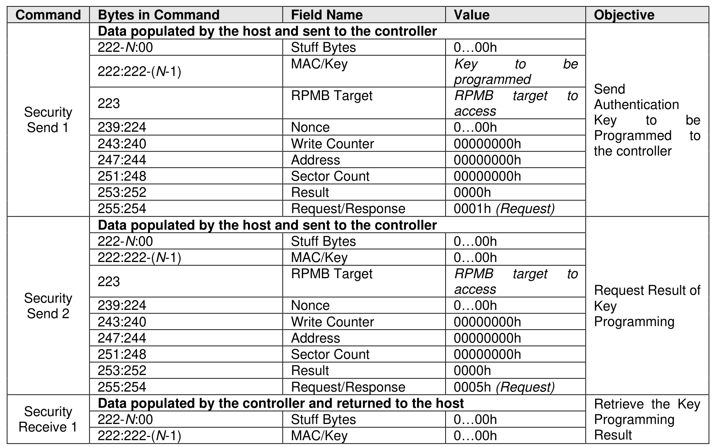
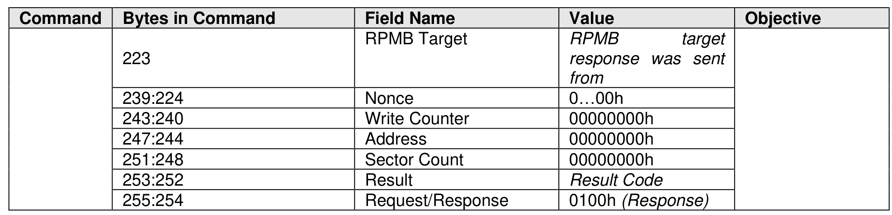

###### 8.1.23.2.1 Authentication Key Programming

> **Section ID**: 8.1.23.2.1 | **Page**: 638-639

Authentication Key programming is initiated by a Security Send command to program the Authentication
Key to the specified RPMB target, followed by a subsequent Security Send command to request the result,
and lastly, the host issues a Security Receive command to retrieve the result.

---
### 📊 Tables (2)

#### Table 1: Untitled Table

| 247:244 | Address | 00000000h |  |
| :--- | :--- | :--- | :--- |
| 251:248 | Sector Count | 00000000h |  |
| 253:252 | Result | 0000h |  |
| 255:254 | Request/Response | 0001h (Request) |  |
| | **Data populated by the host and sent to the controller** | | |
| 222:N:00 | Stuff Bytes | 0...00h | |
| 222:222-(N-1) | MAC/Key | 0...00h | |
| 223 | RPMB Target | *RPMB target to access* | Request Result of Key Programming |
| 239:224 | Nonce | 0...00h | |
| 243:240 | Write Counter | 00000000h | |
| 247:244 | Address | 00000000h | |
| 251:248 | Sector Count | 00000000h | |
| 253:252 | Result | 0000h | |
| 255:254 | Request/Response | 0005h (Request) | |
| | **Data populated by the controller and returned to the host** | | |
| 222-N:00 | Stuff Bytes | 0...00h | Retrieve the Key Programming Result |
| 222:222-(N-1) | MAC/Key | 0...00h | |
| | | | |
| | | | |
| | | | |
| | | | |
| | | | |
| | | |

#### Table 2: Untitled Table

(Continuation of Untitled Table - see first part)

