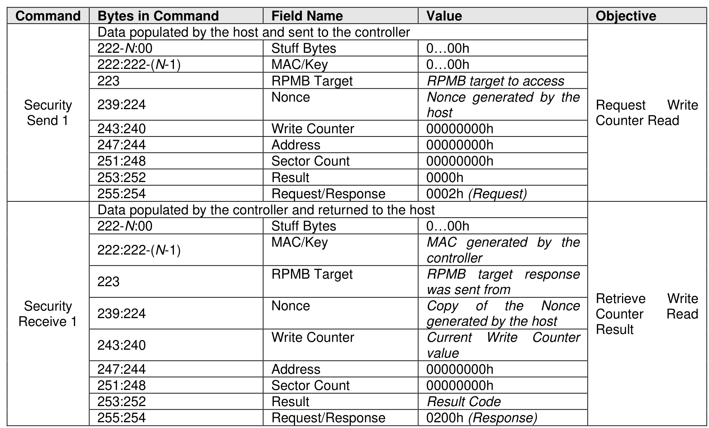

###### 8.1.23.2.2 Read Write Counter Value

> **Section ID**: 8.1.23.2.2 | **Page**: 639-639

The Read Write Counter Value sequence is initiated by a Security Send command to request the Write
Counter value, followed by a Security Receive command to retrieve the Write Counter result.

---
### 📊 Tables (1)

#### Table 1: Untitled Table

| | | | | |
| :--- | :--- | :--- | :--- | :--- |
| 1 | | | | |
| 243:240 | Write Counter | 00000000h | | Counter Read |
| 247:244 | Address | 00000000h | | |
| 251:248 | Sector Count | 00000000h | | |
| 253:252 | Result | 0000h | | |
| 255:254 | Request/Response | 0002h (Request) | | |
| | Data populated by the controller and returned to the host | | | |
| 222-N:00 | Stuff Bytes | 0...00h | | |
| 222:222-(N-1) | MAC/Key | MAC generated by the controller | | |
| 223 | RPMB Target | RPMB target response was sent from | | |
| 239:224 | Nonce | Copy of the Nonce generated by the host | | |
| 243:240 | Write Counter | Current Write Counter value | | |
| 247:244 | Address | 00000000h | | |
| 251:248 | Sector Count | 00000000h | | |
| 253:252 | Result | Result Code | | |
| 255:254 | Request/Response | 0200h (Response) | | |
| | | | Retrieve Counter Result | Write Read |
| | | | | |
| | | | | |
| | | | | |
| | | | | |
| | | | | |

