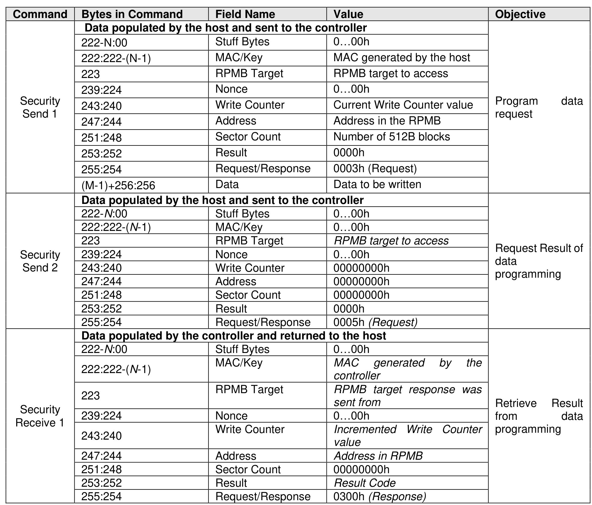

###### 8.1.23.2.3 Authenticated Data Write

> **Section ID**: 8.1.23.2.3 | **Page**: 639-641

The Authenticated Data Write is initiated by a Security Send command. The RPMB Data Frame delivered
from the host to the controller includes the Request Message Type = 0003h, Block Count, Address, Write
Counter, Data and MAC.
When the controller receives this RPMB Data Frame, that controller first checks whether the Write Counter
has expired. If the Write Counter has expired, then that controller sets the RPMB Operation Result to 0085h
(write failure, write counter expired) and no data is written to the RPMB data area.
After checking the Write Counter is not expired, the Address is checked. If there is an error in the Address
(e.g., out of range), then the result is set to 0004h (address failure) and no data is written to the RPMB data
area.
After checking the Address is valid, the controller calculates the MAC (refer to section 8.1.23.1) and
compares this with the MAC in the request. If the MAC in the request and the calculated MAC are different,
then the controller sets the result to 0002h (authentication failure) and no data is written to the RPMB data
area.
If the MAC in the request and the calculated MAC are equal, then the controller compares the Write Counter
in the request with the Write Counter stored in the controller. If the counters are different, then the controller
sets the result to 0003h (counter failure) and no data is written to the RPMB data area.
If the MAC and Write Counter comparisons are successful, then the write request is authenticated. The
Data from the request is written to the Address indicated in the request and the Write Counter is
incremented by one.
If the write fails, then the returned result is 0005h (write failure). If another error occurs during the write
procedure, then the returned result is 0001h (general failure).
The controller returns a successful completion for the Security Send command when the Authenticated
Data Write operation is completed regardless of whether the Authenticated Data Write was successful or
not.
The success of programming the data should be checked by the host by reading the result property of the
RPMB:
1) The host initiates the Authenticated Data Write verification process by issuing a Security Send
command with delivery of a RPMB data frame containing the Request Message Type = 0005h;
2) The controller returns a successful completion of the Security Send command when the verification
result is ready for retrieval;
3) The host should then retrieve the verification result by issuing a Security Receive command; and
4) The controller returns a successful completion of the Security Receive command and returns the
RPMB data frame containing the Response Message Type = 0300h, the incremented counter
value, the data address, the MAC and result of the data programming operation.

---
### 📊 Tables (1)

#### Table 1: Untitled Table

| | | | |
| :--- | :--- | :--- | :--- |
| 222-N:00 | Stuff Bytes | 0...00h | |
| 222:222-(N-1) | MAC/Key | MAC generated by the host | |
| 223 | RPMB Target | RPMB target to access | |
| 239:224 | Nonce | 0...00h | |
| 243:240 | Write Counter | Current Write Counter value | |
| 247:244 | Address | Address in the RPMB | |
| 251:248 | Sector Count | Number of 512B blocks | |
| 253:252 | Result | 0000h | |
| 255:254 | Request/Response | 0003h (Request) | |
| (M-1)+256:256 | Data | Data to be written | |
| | | | Program data request |
| | | | |
| 222-N:00 | Stuff Bytes | 0...00h | |
| 222:222-(N-1) | MAC/Key | 0...00h | |
| 223 | RPMB Target | RPMB target to access | |
| 239:224 | Nonce | 0...00h | |
| 243:240 | Write Counter | 00000000h | |
| 247:244 | Address | 00000000h | |
| 251:248 | Sector Count | 00000000h | |
| 253:252 | Result | 0000h | |
| 255:254 | Request/Response | 0005h (Request) | |
| | | | Request Result of data programming |
| | | | |
| 222-N:00 | Stuff Bytes | 0...00h | |
| 222:222-(N-1) | MAC/Key | MAC generated by the controller | |
| 223 | RPMB Target | RPMB target response was sent from | |
| 239:224 | Nonce | 0...00h | |
| 243:240 | Write Counter | Incremented Write Counter value | |
| 247:244 | Address | Address in RPMB | |
| 251:248 | Sector Count | 00000000h | |
| 253:252 | Result | Result Code | |
| 255:254 | Request/Response | 0300h (Response) | |
| | | | Retrieve Result from data programming |

