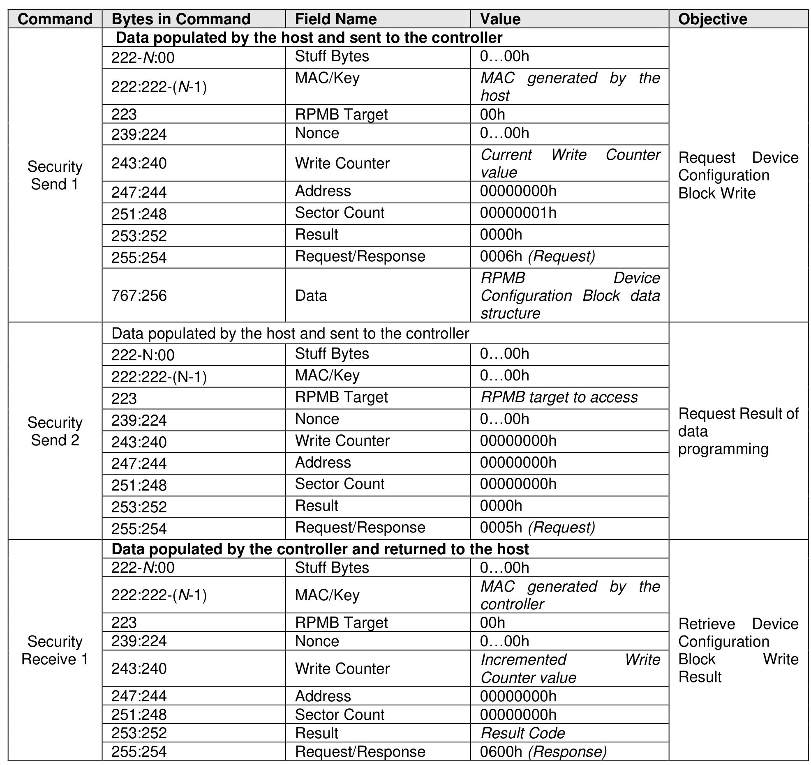

##### 8.1.23.3 Authenticated Device Configuration Block Write

> **Section ID**: 8.1.23.3 | **Page**: 642-643

The Authenticated Device Configuration Block Write is initiated by a Security Send command. The RPMB
Data Frame delivered from the host to the controller includes the Request Message Type = 0006h, Sector
Count = 01h, MAC, Write Counter set to the current Write Counter value, and the RPMB Device
Configuration Block data structure (refer to Figure 699). All other fields are cleared to 0h.
If the Write Counter has expired, then that controller sets the result to 0005h (write failure, write counter
expired) and no data is written to the Device Configuration Block.
The controller calculates the MAC of Request Type, Block Count, Write Counter, Address and Data, and
compares this with the MAC in the request. If the MAC in the request and the calculated MAC are different,
then the controller sets the result to 0002h (authentication failure) and no data is written to the RPMB Device
Configuration Block.
If the Data from the RPMB Device Configuration Block attempts to disable Boot Partition Protection, then
the controller sets the result to 0008h (Invalid RPMB Device Configuration Block) and no data is written to
the RPMB Device Configuration Block.
If the MAC in the request and the calculated MAC are equal, then the write request is authenticated. The
Data from the request is written to the RPMB Device Configuration Block.
If any other error occurs during the write procedure, then the returned result is 0001h (general failure).
The controller returns a successful completion for the Security Send command when the Authenticated
Data Write operation is completed regardless of whether the Authenticated Device Configuration Block
Write was successful or not.
When the host receives a successful completion of the Security Send command from the controller, that
host should send a Security Receive command to the controller to retrieve the data. The controller returns
an RPMB Data Frame with Response Message Type (0600h), the incremented counter value, the MAC,
and the Result. All other fields are cleared to 0h.
The Write Counter for the Device Configuration Block is independent of the Write Counter for RPMB target
0. Authenticated Device Configuration Block Writes do not affect the Write Counter for RPMB target 0 since
the data is not part of the RPMB data area. The current value of the Write Counter for the Device
Configuration Block may be read using an Authenticated Device Configuration Block Read (refer to section
8.1.23.4).

---
### 📊 Tables (1)

#### Table 1: Untitled Table

| 222:222-(N-1) | MAC/Key | MAC generated by the host |
| :--- | :--- | :--- |
| 223 | RPMB Target | 00h |
| 239:224 | Nonce | 0...00h |
| 243:240 | Write Counter | Current Write Counter value |
| 247:244 | Address | 00000000h |
| 251:248 | Sector Count | 00000001h |
| 253:252 | Result | 0000h |
| 255:254 | Request/Response | 0006h (Request) |
| 767:256 | Data | RPMB Device Configuration Block data structure |
| Data populated by the host and sent to the controller | | |
| 222-N:00 | Stuff Bytes | 0...00h |
| 222:222-(N-1) | MAC/Key | 0...00h |
| 223 | RPMB Target | RPMB target to access |
| 239:224 | Nonce | 0...00h |
| 243:240 | Write Counter | 00000000h |
| 247:244 | Address | 00000000h |
| 251:248 | Sector Count | 00000000h |
| 253:252 | Result | 0000h |
| 255:254 | Request/Response | 0005h (Request) |
| Data populated by the controller and returned to the host | | |
| 222-N:00 | Stuff Bytes | 0...00h |
| 222:222-(N-1) | MAC/Key | MAC generated by the controller |
| 223 | RPMB Target | 00h |
| 239:224 | Nonce | 0...00h |
| 243:240 | Write Counter | Incremented Write Counter value |
| 247:244 | Address | 00000000h |
| 251:248 | Sector Count | 00000000h |
| 253:252 | Result | Result Code |
| 255:254 | Request/Response | 0600h (Response) |

