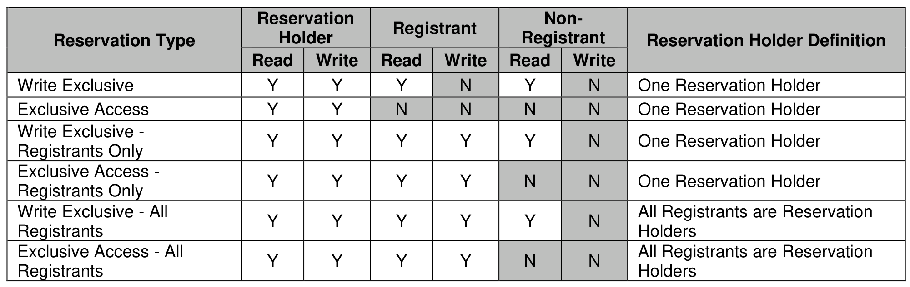
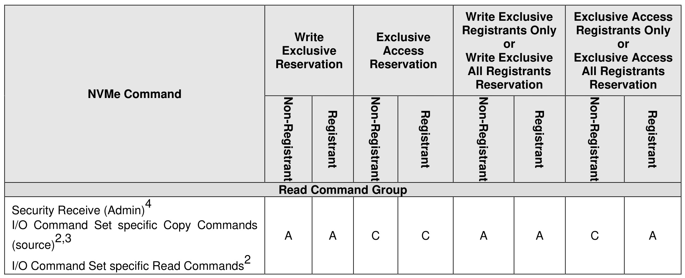
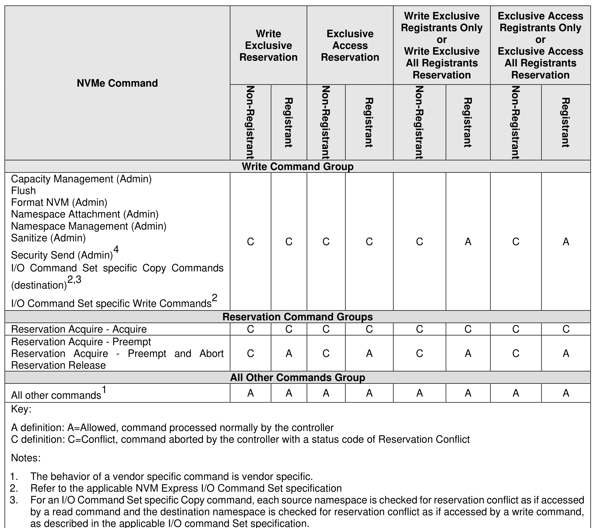

##### 8.1.24.1 Reservation Types

> **Section ID**: 8.1.24.1 | **Page**: 646-648

The NVM Express interface supports six types of reservations:
•
Write Exclusive;
•
Exclusive Access;
•
Write Exclusive - Registrants Only;
•
Exclusive Access - Registrants Only;
•
Write Exclusive - All Registrants; and
•
Exclusive Access - All Registrants.
The differences between these reservation types are: the type of access that is excluded (i.e., writes or all
accesses), whether registrants have the same access rights as the reservation holder, and whether
registrants are also considered to be reservation holders. These differences are summarized in Figure 702
and the specific behavior for each NVM Express command is shown in Figure 703.
Reservations and registrations persist across all Controller Level Resets and all NVM Subsystem Resets
except reset due to power loss. A reservation may be optionally configured to be retained across a reset
due to power loss using the Persist Through Power Loss State (PTPLS). A Persist Through Power Loss
State (PTPLS) is associated with each namespace that supports reservations and may be modified as a
side effect of a Reservation Register command (refer to section 7.6) or a Set Features command (refer to
section 5.2.26).

---
### 📊 Tables (3)

#### Table 1: Untitled Table

| | Read | Write | Read | Write | Read | Write | Reservation Holder Definition |
| :--- | :--- | :--- | :--- | :--- | :--- | :--- | :--- |
| Exclusive | Y | Y | Y | N | Y | N | One Reservation Holder |
| Exclusive Access | Y | Y | N | N | N | N | One Reservation Holder |
| Exclusive - Registants Only | Y | Y | Y | Y | Y | N | One Reservation Holder |
| Exclusive Access - Registants Only | Y | Y | Y | Y | N | N | One Reservation Holder |
| Exclusive - All Registants | Y | Y | Y | Y | Y | N | All Registants are Reservation Holders |
| Exclusive Access - All Registants | Y | Y | Y | Y | N | N | All Registants are Reservation Holders |
| | | | | | | | |
| | | | | | | | |
| | | | | | | | |
| | |

#### Table 2: Untitled Table

(Continuation of Untitled Table - see first part)

#### Table 3: Untitled Table

(Continuation of Untitled Table - see first part)

