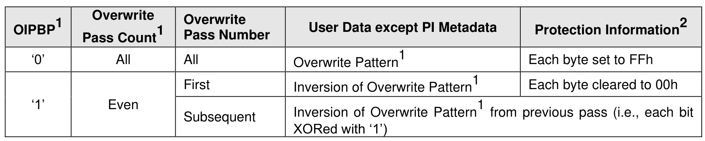
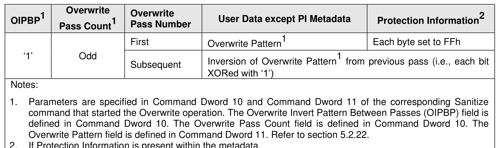

##### 8.1.26.3 Sanitize Operation Types and Support

> **Section ID**: 8.1.26.3 | **Page**: 657-660

The Sanitize Capabilities (SANICAP) field of the Identify Controller data structure (refer to Figure 328)
indicates the sanitize operation types supported and controller attributes specific to sanitize operations.
The sanitize operation types are:
•
the Block Erase sanitize operation, which alters user data with a low-level block erase method that
is specific to the media for all locations on the media within the sanitization target in which user
data may be stored;
•
the Crypto Erase sanitize operation, which alters user data by changing the media encryption keys
for all locations on the media within the sanitization target in which user data may be stored; and
•
the Overwrite sanitize operation, which alters user data by writing a fixed data pattern or related
patterns one or more times to all locations on the media within the sanitization target in which user
data may be stored. Figure 705 defines the data pattern or patterns that are written.
Controller attributes that affect the processing of sanitize operations include:
•
the No-Deallocate Modifies Media After Sanitize (NODMMAS) field, which indicates whether media
is modified by the controller as part of sanitize processing for an NVM subsystem sanitize operation
and that had been requested with the No-Deallocate After Sanitize (NDAS) bit set to ‘1’ in the
Sanitize command that started the NVM subsystem sanitize operation;
•
the No-Deallocate Inhibited (NDI) bit, which indicates if the controller supports the No-Deallocate
After Sanitize bit in the Sanitize command;
•
the Verification Support (VERS) bit, which indicates if the controller supports the Media Verification
state and the Post-Verification Deallocation state for NVM subsystem sanitize operations that
perform block erase or crypto erase; and
•
the Namespace Verification Support (NVERS) bit, which indicates if the controller supports the
Media Verification state and the Post-Verification Deallocation state for namespace sanitize
operations.
If the NODMMAS field indicates a value of 10b in the Identify Controller data structure (refer to Figure 328)
and a Sanitize command that starts an NVM subsystem sanitize operation specifies the No-Deallocate After
Sanitize (NDAS) bit set to ‘1’, then sanitize processing includes additional media modification. Refer to
Annex A.3 for further information about sanitize operations and interactions with integrity circuits.
The Overwrite sanitize operation is media specific and may not be appropriate for all media types. For
example, if the media is NAND, multiple pass overwrite operations may have an adverse effect on media
endurance.
If the NVM subsystem supports the Key Per I/O capability (refer to section 8.1.14), then a sanitize operation
shall alter all user data such that recovery of any previous user data using the KEYTAG values specified
when that previous user data was written (i.e., original KEYTAG values) is infeasible for a given level of
effort (refer to ISO/IEC 27040).
To start a sanitize operation, the host:
•
submits a Sanitize command specifying the SANACT field set to:
o
010b (i.e., start a Block Erase type NVM subsystem sanitize operation);
o
011b (i.e., start an Overwrite type NVM subsystem sanitize operation); or
o
100b (i.e., start a Crypto Erase type NVM subsystem sanitize operation).
or
•
submits a Sanitize Namespace command specifying the SANACT field set to 100b (i.e.
Crypto Erase type namespace sanitize operation).
Following a successful sanitize operation, the values of user data (including protection information (PI), if
any, and non-PI metadata, if any) that result from an audit (refer to section 1.5.11) of the sanitization target
are defined in the NVM Express I/O Command Set specifications.
The Sanitize Status log page (refer to section 5.2.12.1.36) indicates estimated times for sanitize operations
and a consistent snapshot of information about the most recently started sanitize operation for the
sanitization target specified in the Get Log Page command, including whether a sanitize operation is in
progress, the sanitize operation parameters and the status of the most recent sanitize operation. The
controller shall report that a sanitize operation is in progress if:
•
sanitize processing is in progress (including additional media modification, if required);
•
the sanitization target is in the Media Verification state; or
•
the sanitization target is in the Post-Verification Deallocation state.
If an NVM subsystem sanitize operation is not in progress, then the Global Data Erased (GDE) bit in the
log page indicates whether the NVM subsystem contains any user data (i.e., whether the NVM subsystem
has been written to since the most recent successful NVM subsystem sanitize operation).
If a namespace sanitize operation is not in progress on the namespace associated with a Sanitize Status
log page, then the Namespace Data Erased (NDE) bit in that log page indicates whether the namespace
may contain any user data (i.e., whether the namespace has been written to since the most recent
successful namespace sanitize operation).
The Sanitize Status log page shall be:
•
initialized before any controller in the NVM subsystem is ready as described in sections 3.5.3 and
3.5.4;
•
updated when a namespace is created (i.e., the Sanitize Status log page for that namespace is
created); and
•
updated when any state transition occurs (refer to section 8.1.26.4).
The Sanitize Status log page is updated periodically during a sanitize operation to make progress
information available to hosts.
During a sanitize operation, the host may periodically examine the Sanitize Status log page to check for
progress, however, the host should limit this polling (e.g., to at most once every several minutes) to avoid
interfering with the progress of the sanitize operation itself.
The Sanitize Progress (SPROG) field in the Sanitize Status log page indicates progress during states that
may take long times to complete (i.e., the Restricted Processing state, the Unrestricted Processing state,
and the Post-Verification Deallocation state). The SPROG field is cleared to 0h upon entry to any of those
states, and while in any of those states is updated as described in Figure 302. The SPROG field shall not
be modified under any conditions not explicitly permitted by this specification.
A sanitize operation completes when the sanitization target enters any of the following states (refer to
section 8.1.26.4):
•
the Idle state;
•
the Restricted Failure state; or
•
the Unrestricted Failure state.
Upon completion of a sanitize operation or upon entry to the Media Verification state, the host should read
the Sanitize Status log page, specifying the NSID indicating the sanitization target (i.e., cleared to 0h or set
to FFFFFFFFh for the NVM subsystem or set to the NSID of the namespace), and with the Retain
Asynchronous Event bit cleared to ‘0’ (which clears the asynchronous event, if one was generated).
If a command that requests sanitize operations (i.e., the Sanitize command or the Sanitize Namespace
command) is supported, then all controllers in the NVM subsystem shall:
•
support the Sanitize Status log page;
•
support the Sanitize Operation Completed asynchronous event;
•
support the Sanitize Operation Completed With Unexpected Deallocation asynchronous event, if
the Sanitize Config feature is supported;
•
support the Exit Failure Mode action for that command;
•
support at least one of the following sanitize operation types: Block Erase, Overwrite, or Crypto
Erase;
•
support the same set of sanitize operation types for that command;
•
indicate the supported sanitize operation types in the Sanitize Capabilities field in the Identify
Controller data structure; and
•
if the Verification Support (VERS) bit is set to ‘1’ or the Namespace Verification Support (NVERS)
bit is set to ‘1’ in the Identify Controller data structure (refer to Figure 328), support:
o
the FAILS field in the Sanitize Status log page (refer to section 5.2.12.1.36);
o
the SANS field in the Sanitize Status log page;
o
the Media Verification state;
o
the Post-Verification Deallocation state; and
o
the Sanitize Operation Entered Media Verification State asynchronous event.
The Sanitize Config Feature Identifier (refer to section 5.2.26.1.15) contains the No-Deallocate Response
Mode (NODRM) bit that specifies the response of the controller to a Sanitize command specifying the No-
Deallocate After Sanitize (NDAS) bit (refer to Figure 388) set to ‘1’ if the No-Deallocate Inhibited bit is set
to ‘1’ in the Sanitize Capabilities field of the Identify Controller data structure (refer to Figure 328). In the
No-Deallocate Error Response Mode, the controller aborts such Sanitize commands with a status code of
Invalid Field in Command. In the No-Deallocate Warning Response Mode, the controller processes such
Sanitize commands, and if a resulting NVM subsystem sanitize operation is completed successfully, then
the SOS field is set to 100b (i.e., Sanitized Unexpected Deallocate) in the Sanitize Status log page (refer
to Figure 302).

---
### 📊 Tables (2)

#### Table 1: Untitled Table

| | Pass Count | Pass Number | | |
| :--- | :--- | :--- | :--- | :--- |
| | | First | Overwrite Pattern¹ | Each byte set to FFh |
| | Odd | | | |
| | | Subsequent | Inversion of Overwrite Pattern¹ from previous pass (i.e., each bit XORed with '1') | |

#### Table 2: Untitled Table

(Continuation of Untitled Table - see first part)

