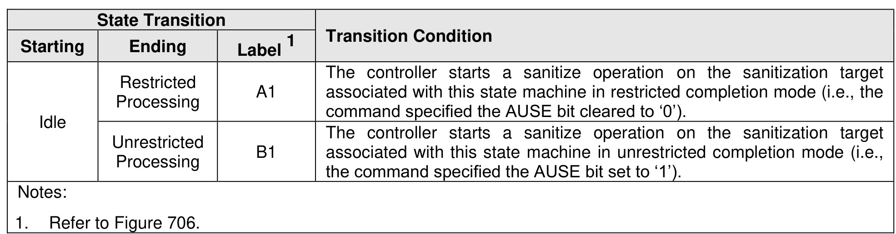

###### 8.1.26.4.1 Idle State

> **Section ID**: 8.1.26.4.1 | **Page**: 662-663

In this state, no sanitize operation is in process. This state applies in the following cases:
a) no sanitize operation has ever been performed:
o
on the NVM subsystem since the NVM subsystem was manufactured; or
o
on the namespace since the namespace was created;
b) the most recent sanitize operation on the sanitization target was successful; and
c) the most recent sanitize operation failed in unrestricted completion mode (i.e
specified the AUSE bit set to ‘1’) and then the Sanitize Operation State Machine t
the Unrestricted Failure state to the Idle state when any controller in the NVM subsy
an Exit Failure Mode action on the sanitization target associated with this state m
In this state, the Sanitize command and the Sanitize Namespace command are processed without
restrictions. In this state, any controller in the NVM subsystem processing a Sanitize command specifying
the Sanitize Action field set to 001b (i.e., Exit Failure Mode) and specifying the sanitization target associated
with this state machine shall not be considered an error.
In this state, all controllers in the NVM subsystem are permitted to resume any power management that
was suspended by any prior sanitize operation.
The controller shall, in the Sanitize Status log page for the sanitization target, clear the:
a) Sanitize Progress (SPROG) field to 0h; and
b) Media Verification Canceled (MVCNCLD) bit to ‘0’.
The controller shall, in the Sanitize Status log page for the sanitization target, clear the:
a) Sanitize Progress (SPROG) field to 0h; and
b) Media Verification Canceled (MVCNCLD) bit to ‘0’.

---
### 📊 Tables (1)

#### Table 1: Untitled Table

| 638 |

