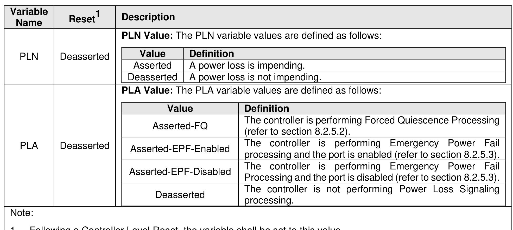

#### 8.2.5 Power Loss Signaling

> **Section ID**: 8.2.5 | **Page**: 686-688

Power Loss Signaling (PLS) is a capability that the host uses to inform all controllers in a domain of
impending power loss, and that each controller uses to inform the host that the controller is preparing for
that power loss.
There are two modes of Power Loss Signaling processing, Forced Quiescence Processing (refer to section
8.2.5.2) and Emergency Power Fail Processing (refer to section 8.2.5.3). All controllers in a domain support
the same modes (i.e., all controllers report the same value in the PLSFQ bit and all controllers report the
same value in the PLSEPF bit; refer to Figure 328).
Not more than one Power Loss Signaling mode is active at any time. The host uses the Power Loss
Signaling Config feature (refer to section 5.2.26.1.19) to select the mode of operation or to disable Power
Loss Signaling. All controllers in a domain use the same mode (i.e., the scope of the Power Loss Signaling
Config feature is domain). The selection persists across power cycles as defined in Figure 403.
Each controller contains two variables which are used by Power Loss Signaling to perform communication
between the host and controller:
•
The Power Loss Notification (PLN) variable is set by the NVMe Transport and has two values,
Asserted and Deasserted.
•
The Power Loss Acknowledge (PLA) variable is set by the controller and has four values, Asserted-
FQ, Asserted-EPF-Enabled, Asserted-EPF-Disabled, and Deasserted.
The values of the variables are described in Figure 717.
Transport-specific details of the PLN variable and the PLA variable, including effects on communication
connectivity between host and controller, are described in the Power Loss Signaling Support section of the
applicable NVM Express Transport specification and in the Power Loss Signaling Interactions section of
the NVM Express Management Interface Specification.
If the controller supports Power Loss Signaling, then the controller:
•
shall support the PLN variable as specified in this section;
•
may support the PLA variable as specified in this section;
•
shall support Forced Quiescence Processing (refer to section 8.2.5.2), Emergency Power Fail
Processing (refer to section 8.2.5.3), or both;
•
if Forced Quiescence Processing is supported, shall report a non-zero value in the Forced
Quiescence Vault Time field in the Power State Descriptor of one or more of the supported power
states (refer to Figure 329);
•
if Emergency Power Fail Processing is supported, shall report non-zero values in the Emergency
Power Fail Vault Time field and the Emergency Power Fail Recovery Time field in the Power State
Descriptor of one or more of the supported power states (refer to Figure 329);
•
shall support reporting of whether I/O performance is degraded in the I/O Impacted (IOI) field (i.e.,
reports values 10b and 11b) in the I/O Command Set Independent Identify Namespace data
structure (refer to Figure 335); and
•
shall support the Power Loss Signaling Config feature (refer to section 5.2.26.1.19).
If the PLN variable is set to Asserted, then the controller performs either Forced Quiescence or Emergency
Power Fail Processing, as determined by the setting of the Power Loss Signaling Config feature.
The controller shall ignore transitions in the PLN variable if:
a) a Controller Level Reset (refer to section 3.7.2) is in process; or
b) if the CSTS.SHST field is not cleared to 00b (i.e., the controller is in the process of shutting down
or has completed shutdown).
If the PLN variable is set to Asserted and the controller is in a power state for which:
a) the Emergency Power Fail Vault Time field is cleared to 0h;
b) the Forced Quiescence Vault Time field is cleared to 0h; or
c) the Emergency Power Fail Recovery Time field is cleared to 0h,
then the time to perform an action for which the corresponding value is cleared to 0h is vendor specific.
If the controller is in the EPF Complete Port Enabled state, the EPF Complete Port Disabled state, or the
FQ Complete state and power is lost, then during the first restoration of power following the power loss,
processing of commands may be affected while the controller performs internal recovery operations.
Examples of these effects include:
a) a namespace not being ready (i.e., the NRDY bit is cleared to ‘0’ in the NSTAT field; refer to Figure
335); and
b) commands to a namespace being processed at reduced performance, as indicated by the IOI field
in the NSTAT field (refer to Figure 335).

---
### 📊 Tables (1)

#### Table 1: Untitled Table

| | Value | Definition |
|---|---|---|
| | Asserted | A power loss is impending. |
| | Deasserted | A power loss is not impending. |
| | **PLA Value:** The PLA variable values are defined as follows: | |
| | Value | Definition |
| | Asserted-FQ | The controller is performing Forced Quiescence Processing (refer to section 8.2.5.2). |
| | Asserted-EPF-Enabled | The controller is performing Emergency Power Fail processing and the port is enabled (refer to section 8.2.5.3). |
| | Asserted-EPF-Disabled | The controller is performing Emergency Power Fail Processing and the port is disabled (refer to section 8.2.5.3). |
| | Deasserted | The controller is not performing Power Loss Signaling processing. |

