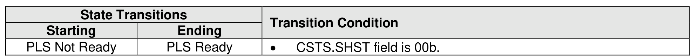

###### 8.2.5.1.1 PLS Not Ready State

> **Section ID**: 8.2.5.1.1 | **Page**: 689-689

In the PLS Not Ready state, the controller is not performing Power Loss Signaling processing. The controller
enters the PLS Not Ready state following any Controller Level Reset or if the CSTS.SHST field is not
cleared to 00b (i.e., the controller is in the process of shutting down or has completed shutdown).
Transitions out of this state are defined in Figure 720.

---
### 📊 Tables (1)

#### Table 1: Untitled Table

| | | | | | | | | |
|---|---|---|---|---|---|---|---|---|
| | | | | | | | | |
| | | | | | | | | |
| | | | | | | | | |

