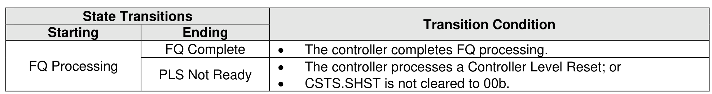

###### 8.2.5.1.3 FQ Processing State

> **Section ID**: 8.2.5.1.3 | **Page**: 690-690

In the FQ Processing state, the controller is performing Forced Quiescence Processing, as described in
section 8.2.5.2.
Transitions out of this state are defined in Figure 722.

---
### 📊 Tables (1)

#### Table 1: Untitled Table

| State Transitions |  | Transition Condition |
| :--- | :--- | :--- |
| Starting | Ending | |
| FQ Complete | FQ Idle | The controller has completed Forced Quiescence Processing. |

