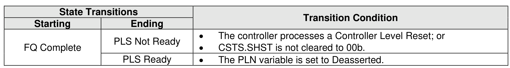

###### 8.2.5.1.4 FQ Complete State

> **Section ID**: 8.2.5.1.4 | **Page**: 690-690

In the FQ Complete state, the controller has completed Forced Quiescence Processing.
Transitions out of this state are defined in Figure 723.

---
### 📊 Tables (1)

#### Table 1: Untitled Table

| Controller Level Reset;   controller shutdown;   NVM Subsystem Reset; and   NVM Subsystem Shutdown. |

