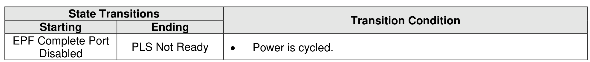

###### 8.2.5.1.6 EPF Complete Port Disabled State

> **Section ID**: 8.2.5.1.6 | **Page**: 691-691

In the EPF Complete Port Disabled state, the controller has completed Emergency Power Fail Processing.
The port is disabled. The following are not able to be initiated through the port:
a) Controller Level Reset;
b) controller shutdown;
c) NVM Subsystem Reset; and
d) NVM Subsystem Shutdown.
Transitions out of this state are defined in Figure 725.

---
### 📊 Tables (1)

#### Table 1: Untitled Table

| State Transition | Conditions |
| :--- | :--- |
| EPF Processing Port Enabled → EPF Processing Port Disabled | The controller is not performing Emergency Power Fail Processing. |
| EPF Processing Port Disabled → EPF Processing Port Enabled | The controller is performing Emergency Power Fail Processing. |
| EPF Processing Port Enabled → EPF Processing Port Disabled | The port is disabled. |
| EPF Processing Port Disabled → EPF Processing Port Enabled | The port is enabled. |

