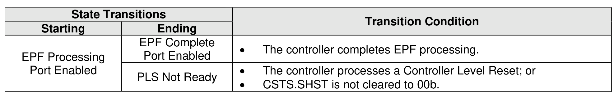

###### 8.2.5.1.7 EPF Processing Port Enabled State

> **Section ID**: 8.2.5.1.7 | **Page**: 691-691

In the EPF Processing Port Enabled state, the controller is performing Emergency Power Fail Processing,
as described in section 8.2.5.3. The port is enabled.
Transitions out of this state are defined in Figure 726.

---
### 📊 Tables (1)

#### Table 1: Untitled Table

| State Transitions | | Transition Condition |
| :--- | :--- | :--- |
| Starting | Ending | |
| Complete Port Enabled | PLS Not Ready | • The controller processes a Controller Level Reset; or • OCTS CHST is not cleared to 00h |

