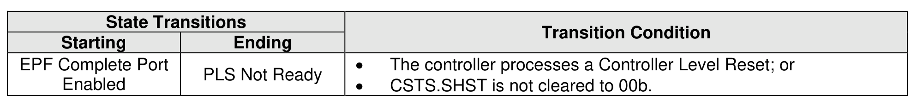

###### 8.2.5.1.8 EPF Complete Port Enabled State

> **Section ID**: 8.2.5.1.8 | **Page**: 691-691

In the EPF Complete Port Enabled state, the controller has completed Emergency Power Fail Processing.
The port is enabled.
Transitions out of this state are defined in Figure 727.

---
### 📊 Tables (1)

#### Table 1: Untitled Table

| | 2018 | 2017 | 2016 |
| :--- | :--- | :--- | :--- |
| **Net sales** | $1,057.8 | $1,017.8 | $988.5 |
| **Cost of sales** | 788.2 | 758.8 | 732.8 |
| **Gross profit** | 269.6 | 259.0 | 255.7 |
| **Selling, general and administrative expenses** | 185.0 | 177.4 | 172.4 |
| **Research and development expenses** | 28.8 | 27.4 | 26.8 |
| **Total operating expenses** | 213.8 | 204.8 | 199.2 |
| **Operating income** | 55.8 | 54.2 | 56.5 |
| **Other income (expense), net** | 1.0 | 1.0 | 1.0 |
| **Income before income taxes** | 56.8 | 55.2 | 57.5 |
| **Income tax expense** | 14.4 | 14.0 | 14.7 |
| **Net income** | $42.4 | $41.2 | $42.8 |
| **Earnings per share** | | | |
| Basic | $0.54 | $0.53 | $0.55 |
| Diluted | $0.54 | $0.53 | $0.55 |
| **Weighted average shares outstanding** | | | |
| Basic | 78.4 | 77.8 | 77.8 |
| Diluted | 78.4 | 77.8 | 77.8 |

